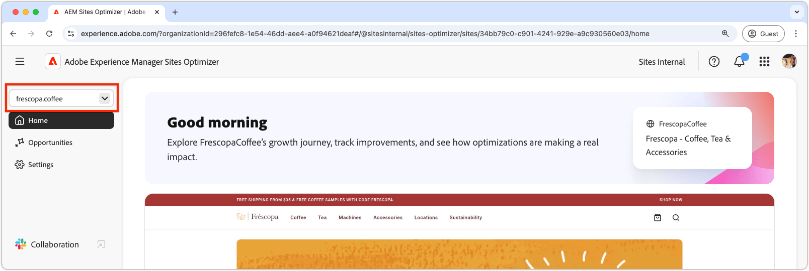
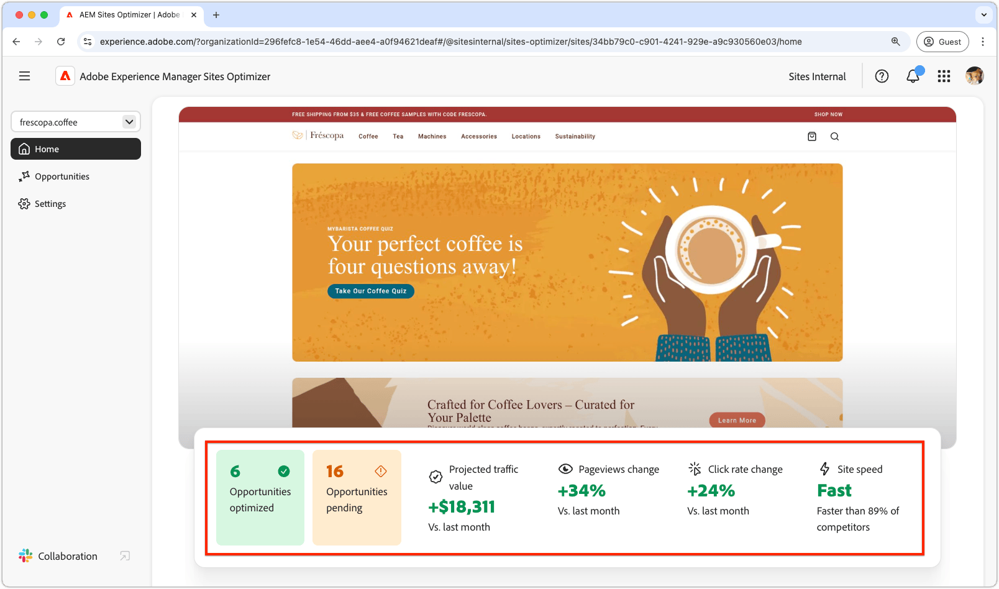

# Grundläggande om Sites Optimizer

{align="center"}

Sites Optimizer Dashboard ger en översikt på hög nivå över webbplatsens prestanda och möjligheter till förbättringar.

## Domänhanterare

{align="center"}

På snabbmenyn för domänhanteraren kan du välja vilken AEM-webbplats (per domän) du vill utvärdera och optimera. Sites Optimizer tillhandahåller en lista över alla AEM webbplatser som registrerats i [Cloud Manager](https://experienceleague.adobe.com/en/docs/experience-manager-cloud-service/content/implementing/using-cloud-manager/edge-delivery-sites/add-edge-delivery-site).

## Navigering

{align="center"}

I navigeringsavsnittet får du snabb, permanent åtkomst till viktiga delar av Sites Optimizer från valfri plats i Sites Optimizer:

* **Hem** - Huvudinstrumentpanelen med en översikt över webbplatsens prestanda och möjligheter till förbättringar.
* **Affärsmöjligheter** - Visa och hantera affärsmöjligheter som identifieras av Sites Optimizer, inklusive affärsmöjligheter som har optimerats eller förblir ooptimerade.
* **Inställningar** - Konfigurera dina Sites Optimizer-inställningar, inklusive de webbplatser du övervakar och de meddelanden du får.

## Webbplatssammanfattning

{align="center"}

I avsnittet Webbplatssammanfattning finns en ögonblicksbild av webbplatsens prestanda, hur Sites Optimizer har förbättrat webbplatsen över tid och möjligheter till förbättringar. Viktiga mätvärden är:

* **Affärsmöjligheter optimerade** - Antalet identifierade affärsmöjligheter som har förbättrats för att förbättra affärsresultatet.
* **Väntande affärsmöjligheter** - Antalet potentiella förbättringar som förblir ooptimerade, representerar områden för affärsvinster.
* **Projekttrafikvärde** - Ändringen av webbplatsens beräknade värde jämfört med förra månaden, vilket hjälper till att mäta hur mycket Site Optimizer bidrar till affärsmålen.
* **Sidor ändras** - procentandelen av hur ofta webbplatsen visas, vilket återspeglar användarnas intresse och innehållseffektivitet.
* **Klicka på prisförändringen** - Den procentuella förändringen i hur ofta användarna klickar, vilket anger förändringar i engagemang och konverteringspotential.
* **Webbplatshastighet** - En nyckelindikator på webbplatsens hastighet och användbarhet, som påverkar användarupplevelsen och sökrankningen.

## Möjligheter med hög effekt

{align="center"}

Avsnittet High Impact Opportunity (möjligheter med hög effekt) belyser de viktigaste väntande möjligheterna till förbättring, baserat på deras potentiella inverkan på webbplatsens prestanda. Dessa möjligheter är ordnade efter typ, vilket gör det enkelt att prioritera optimeringsarbetet.

Filtrera möjligheter efter nyckelord, taggar, URL:er eller [typ av affärsmöjlighet](../opportunity-types/overview.md) för att fokusera på de viktigaste områdena av förbättring.

### Information om affärsmöjlighet

{align="center"}

Varje möjlighet ger en kort beskrivning av problemet, dess potentiella inverkan på er webbplats och en länk till fullständig information. Du kan också se dess status och ange om den har optimerats eller fortfarande väntar.

* **Affärsmöjlighetens titel** - En kort beskrivning av problemet och dess potentiella inverkan på webbplatsens prestanda.
* **Senast uppdaterad** - Sites Optimizer uppdaterade senast affärsmöjligheten med nya data detta datum.
* **Antal problem** - Antalet instanser av problemet som har identifierats på din webbplats.
* **Affärsmöjlighetstyper** - De [typer av affärsmöjlighet](../opportunity-types/overview.md) som den här affärsmöjligheten är en del av - till exempel trafikförvärv, engagemang, konvertering eller webbplatshälsa.

Sammanfattningsinformationen för varje affärsmöjlighet varierar beroende på typ och kan innehålla information om intäktseffekter, trafik, användarengagemang eller säkerhetshot.

Om du vill visa information om en affärsmöjlighet klickar du på knappen **Detaljer** .

Klicka på knappen **Ignorera** om du vill utesluta en affärsmöjlighet från Sites Optimizer kontrollpanel och rapporter.
