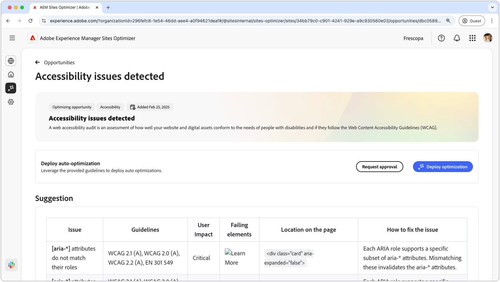
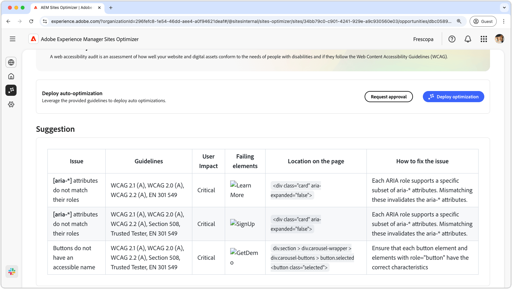

# Möjlighet till tillgänglighetsproblem

{align="center"}

Möjligheten att skapa tillgänglighetsproblem identifierar hur bra din webbplats uppfyller behoven hos personer med funktionshinder och om de följer [Web Content Accessibility Guidelines (WCAG)](https://www.w3.org/TR/WCAG21/). Genom att bedöma hur väl webbplatsen uppfyller WCAG-kraven kan du skapa en omfattande onlineupplevelse, så att personer med nedsatt syn, hörsel, kognitiv och motorik kan navigera i, interagera med och dra nytta av innehållet. Detta är inte bara nödvändigt av etiska skäl, utan det främjar också efterlevnad av juridiska krav, förbättrar SEO och kan öka er målgrupp, vilket förbättrar både användarupplevelsen och affärsprestandan.

## Automatisk identifiering

{align="center"}

**Accessibility Issues-affärsmöjligheten** identifierar tillgänglighetsproblem på din webbplats och innehåller följande:

* **Problem** - Det specifika tillgänglighetsproblemet hittades.
* **Riktlinjer** - ID:t [WCAG-riktlinjer](https://www.w3.org/TR/WCAG21/) som problemet gäller bryter mot.
* **Användarpåverkan** - En bedömning av effekten för användare med funktionshinder.
* **Saknade element** - HTML-elementen på webbsidan som påverkas av problemet.
* **Plats på sidan** - HTML-fragmentet för elementet på sidan som påverkas av problemet.

## Föreslå automatiskt

{align="center"}

Automatiskt förslag ger AI-genererade rekommendationer i fältet **Så här åtgärdar du problemet**. Där finns en guide om vad som ska göras för att åtgärda problemet.

## Automatisk optimering

[!BADGE Ultimate]{type=Positive tooltip="Ultimate"}

{align="center"}

Sites Optimizer Ultimate lägger till möjligheten att driftsätta automatisk optimering för de sårbarheter som hittas.

>[!BEGINTABS]

>[!TAB Distribuera optimering]

{{auto-optimize-deploy-optimization-slack}}

>[!TAB Begär godkännande]

{{auto-optimize-request-approval}}

>[!ENDTABS]
