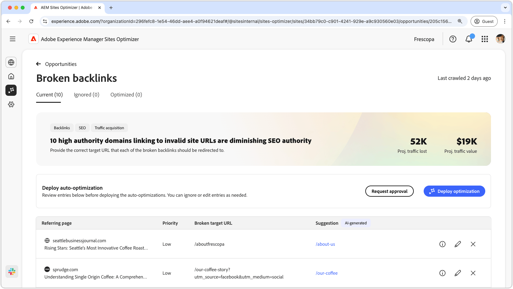
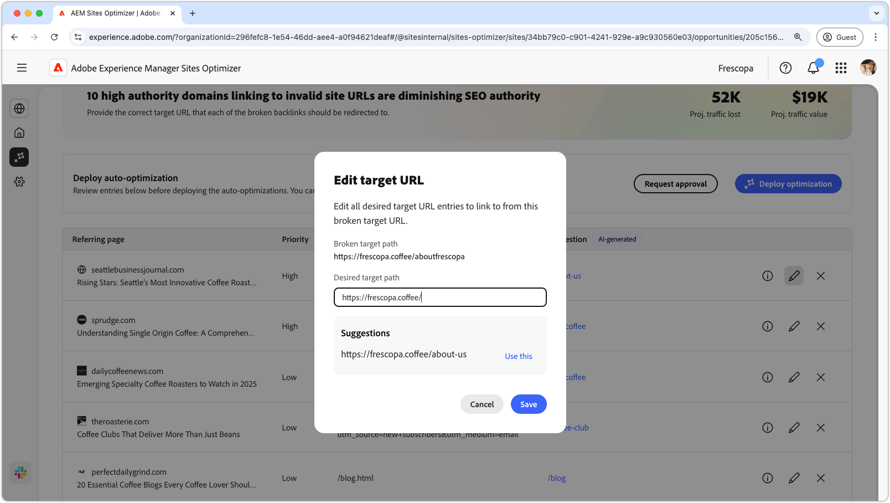

# Brutna bakgrundsmöjligheter

{align="center"}

Den brutna bakåtlänksmöjligheten identifierar länkar från andra webbplatser till din webbplats som leder till ett 404-fel. Eftersom sökmotorer använder baklänkar för att avgöra sökrelevans, kan brutna länkar påverka webbplatsens SEO negativt och göra det lättare att hitta den. Dessa problem kan bero på faktorer som URL-ändringar eller borttagning av den länkade sidan.

Den brutna bakåtlänksmöjligheten visar en sammanfattning högst upp på sidan, inklusive en sammanfattning av problemet och dess inverkan på er webbplats och verksamhet.

* **Prognostiserad trafikförlust** - Den beräknade trafikförlusten på grund av trasiga baklänkar.
* **Planerat trafikvärde** - Det uppskattade värdet av förlorad trafik.

## Automatisk identifiering

{align="center"}

Den brutna bakåtlänksmöjligheten listar alla trasiga bakgrunder på din webbplats, inklusive:

* **Refererande sida** - Webbplatsdomänen som innehåller den brutna länken.
* **Prioritet** - Hög, medel eller låg, vilket indikerar vilken påverkan den brutna länken har på SEO baserat på TODO.
* **Bruten mål-URL** - Den URL på din webbplats som länkas till finns inte.

## Föreslå automatiskt

{align="center"}

Den brutna bakåtlänksmöjligheten ger även en AI-genererad förslag på vilken sida på webbplatsen som den brutna URL:en ska dirigeras om till. Förslagen baseras på den text som innehåller den brutna URL:en och innehållet på den föreslagna sidan.

>[!BEGINTABS]

>[!TAB AI-logik]

{align="center"}

Välj ikonen **information** om du vill visa AI-logiken för den föreslagna URL:en. Motiveringen förklarar varför AI anser att den föreslagna URL:en är den lämpligaste för den brutna länken. Detta kan hjälpa er att förstå AI:s beslutsprocess och fatta ett välgrundat beslut om huruvida ni ska godkänna eller avvisa förslaget.

>[!TAB Redigera mål-URL]

{align="center"}

Om du inte håller med om det AI-genererade förslaget kan du redigera den föreslagna URL:en genom att välja **redigeringsikonen**. På så sätt kan du manuellt ange den URL som du tror passar bäst för den brutna länken. Sites Optimizer listar även andra URL:er på er webbplats som de tror kan passa för den brutna länken.

>[!TAB Ignorera poster]

{align="center"}

Du kan välja att ignorera poster med den brutna mål-URL:en. Om du väljer ikonen **Ignorera** tas den brutna baklänken bort från affärsmöjlighetslistan. Ignorerade brutna baklänkar kan användas igen från fliken **Ignorerad** högst upp på affärsmöjlighetssidan.

>[!ENDTABS]

## Automatisk optimering

[!BADGE Ultimate]{type=Positive tooltip="Ultimate"}

{align="center"}

Sites Optimizer Ultimate ger möjlighet att automatiskt optimera för trasiga bakgrunder. Om du väljer **Automatisk optimering** uppdateras AEM-webbplatsens omdirigeringsregler automatiskt så att den **brutna mål-URL:en** mappas till den **föreslagna URL:en**. Detta garanterar att webbplatsbesökare och sökbotar som följer de brutna länkarna på de **refererande sidorna** dirigeras om till rätt sida på webbplatsen, vilket förbättrar SEO och användarupplevelsen.

>[!BEGINTABS]

>[!TAB Distribuera optimering]

{align="center"}

Om du väljer **Distribuera optimering** uppdateras omdirigeringsreglerna för AEM-webbplatsen så att den **brutna mål-URL:en** mappas till den **föreslagna URL:en**. Detta garanterar att webbplatsbesökare och sökbotar som följer de brutna länkarna på de **refererande sidorna** dirigeras om till rätt sida på webbplatsen, vilket förbättrar SEO och användarupplevelsen.

>[!TAB Begär godkännande]

{align="center"}

{{auto-optimize-request-approval}}

>[!ENDTABS]
