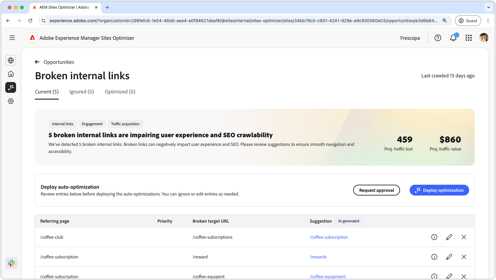
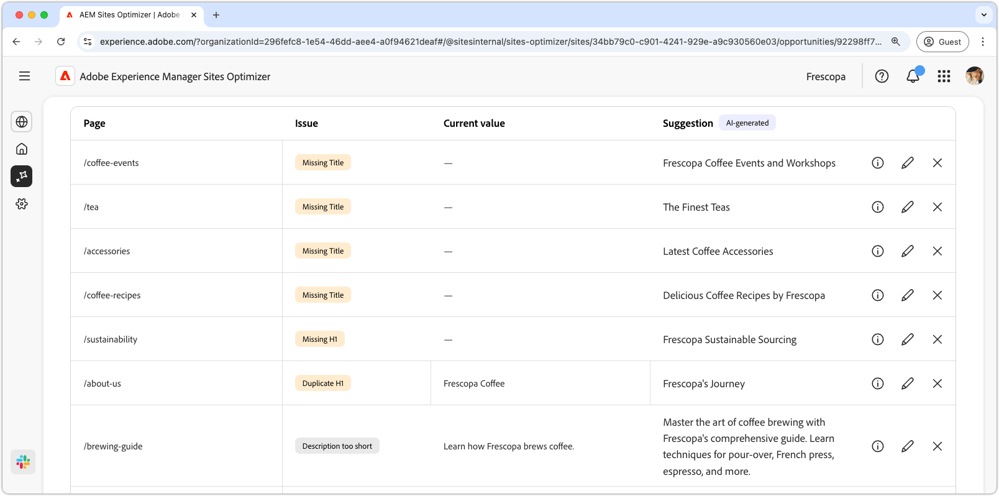

# Ogiltig eller saknad metadatamöjlighet

{align="center"}

Brutna interna länkar påverkar sökmotorns förmåga att indexera webbplatsen och påverkar både användarupplevelsen och sökmotoroptimeringen negativt. För att åtgärda det här problemet pekar de brutna interna länkarna ut trasiga URL:er och ger förslag på giltiga länkuppdateringar. Genom att ta itu med dessa problem kan du förbättra användarinteraktionen och säkerställa smidig navigering och tillgänglighet.

Affärsmöjligheten med brutna interna länkar visar en sammanfattning högst upp på sidan, inklusive en sammanfattning av problemet och dess inverkan på er webbplats och verksamhet.

* **Prognostiserad trafik förlorad** - Den beräknade trafikförlusten på grund av brutna interna länkar.
* **Planerat trafikvärde** - Det uppskattade värdet av förlorad trafik.

## Automatisk identifiering

<!---{align="center"}-->

De brutna interna länkarna gör det möjligt att automatiskt identifiera och visa alla brutna interna länkar på dina sidor, och inkluderar följande:

* **Refererande sida** - Sidan som innehåller den brutna länken.
* **URL för brutet mål** - Den brutna interna länken.
* **Förslag** - Ett AI-genererat förslag om hur den brutna länken ska uppdateras. Mer information finns i avsnittet för automatiska förslag.

## Föreslå automatiskt

<!--{align="center"}-->

Affärsmöjligheten med brutna interna länkar ger AI-genererade förslag på hur man uppdaterar brutna länkar. De här förslagen baseras på den trasiga URL:en och ger en lämplig ersättning. Om du väljer **informationsikonen** får du en AI-genererad logik för den föreslagna uppdateringen.

>[!BEGINTABS]

>[!TAB AI-logik]

<!--[AI rationale of broken internal links](./assets/broken-internal-links/auto-suggest-ai-rationale.png) -->

Välj ikonen **information** om du vill visa AI-logiken för den föreslagna URL:en. Motiveringen förklarar varför AI anser att den föreslagna URL:en är den lämpligaste för den brutna länken. Detta kan hjälpa er att förstå AI:s beslutsprocess och fatta ett välgrundat beslut om huruvida ni ska godkänna eller avvisa förslaget.

>[!TAB Redigera mål-URL]

<!--{align="center"}-->

Om du inte håller med om det AI-genererade förslaget kan du redigera det föreslagna länkvärdet genom att välja **redigeringsikonen**. På så sätt kan du ange länken manuellt. Redigeringsfönstret innehåller länkens **brutna målsökväg**, den **önskade målsökvägen** där du kan redigera länken manuellt och ett fält med det AI-genererade förslaget. När du är klar med redigeringen klickar du på **Spara** för att uppdatera den brutna länkposten. En gul punkt visas i inmatningsfältet för att ange att länken har redigerats.

>[!TAB Ignorera poster]

<!--{align="center"}-->

Du kan välja att ignorera poster med de brutna URL-adresserna som mål. Om du väljer ikonen **Ignorera** tas posten bort från affärsmöjlighetslistan. Ignorerade poster kan återkopplas från fliken **Ignorerad** högst upp på affärsmöjlighetssidan.

>[!ENDTABS]

## Optimera [!BADGE Ultimate] automatiskt{type=Positive tooltip="Ultimate"}

<!---{align="center"}-->

Sites Optimizer Ultimate lägger till möjligheten att automatiskt optimera för de brutna länkar som affärsmöjligheten hittar. <!--- TBD-need more in-depth and opportunity specific information here. What does the auto-optimization do?-->

>[!BEGINTABS]

>[!TAB Distribuera optimering]

{{auto-optimize-deploy-optimization-slack}}

>[!TAB Begär godkännande]

{{auto-optimize-request-approval}}

>[!ENDTABS]

