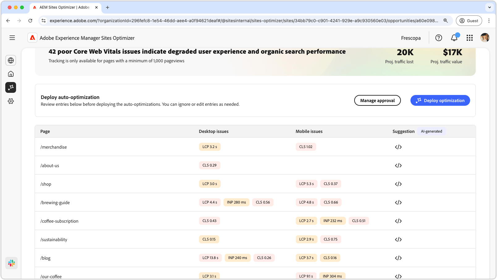

# Affärsmöjligheter i viktiga webbinarier

{align="center"}

Affärsmöjligheterna i de centrala webbprojekten identifierar problem som kan försämra användarupplevelsen och prestanda för organiska sökningar på dina webbsidor. Dessa problem kan uppstå från en mängd olika faktorer som anpassade teckensnitt, ooptimerade javascript-beroenden, skript från tredje part och så vidare. Kärnans webbartivitaler pekar på dessa felaktiga element och föreslår korrigeringar som kan öka webbsidans prestanda. Observera att endast sidor som har minst 1 000 sidvisningar kan analyseras.

Till att börja med visas en sammanfattning högst upp på sidan i de centrala webbinarierna, inklusive en sammanfattning av problemet och dess inverkan på er webbplats och verksamhet.

* **Prognostiserad trafikförlust** - Den beräknade trafikförlusten på grund av viktiga webbinarier som ligger under prestandatröskeln.
* **Planerat trafikvärde** - Det uppskattade värdet av förlorad trafik.

## Automatisk identifiering

{align="center"}

I den nedre delen av sidan finns en lista med alla aktuella utgåvor grupperade som:

* **Mobilproblem** - En lista med problem som påverkar den mobila versionen av sidan.
* **Skrivbordsproblem** - En lista med problem som påverkar skrivbordsversionen av sidan.

Varje utgåva visas i en tabell där kolumnen **Sida** identifierar den berörda sidposten.

Dessutom grupperas dessa problem också efter standardprestandamätningarna i kärnrapporten för webbinarier: den största innehållsmässiga målningen **LCP**, interaktion med nästa målning **INP** och kumulativ layoutändring **CLS** .

## Föreslå automatiskt

{align="center"}

Affärsmöjligheterna i de centrala webbartiven ger förslag på AI-genererade lösningar. När du klickar på förslagsknappen visas ett nytt fönster som innehåller prestandamätningarna **LCP**, **INP** och **CLS** som kategorier. Du kan växla mellan dessa kategorier om du vill se en lista med specifika problem.

Varje kategori kan innehålla flera problem så se till att bläddra nedåt för att se en fullständig lista över problem och rekommendationer.  Dessutom finns det två prestandamätningar för både mobil och dator för varje mätvärde.

## Optimera [!BADGE Ultimate] automatiskt{type=Positive tooltip="Ultimate"}

{align="center"}

Sites Optimizer Ultimate lägger till möjligheten att automatiskt optimera för de problem som uppstår i de centrala webbinarierna. <!--- TBD-need more in-depth and opportunity specific information here. What does the auto-optimization do?-->

>[!BEGINTABS]

>[!TAB Distribuera optimering]

{{auto-optimize-deploy-optimization-slack}}

>[!TAB Begär godkännande]

{{auto-optimize-request-approval}}

>[!ENDTABS]

