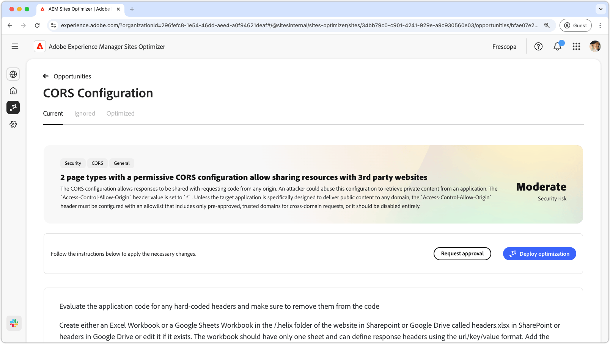

# CORS-konfigurationsmöjlighet

{align="center"}

Korrekt konfigurering av Cross-Origin Resource Sharing (CORS) är nödvändigt för att skydda webbapplikationer mot obehörig dataåtkomst. När rubriken `Access-Control-Allow-Origin` är inställd på `*` kan alla domäner begära och ta emot svar, vilket kan medföra att känslig information exponeras för angripare. Denna funktion ger möjlighet att stärka säkerheten genom att implementera en kontrollerad tillåtelselista av betrodda domäner eller inaktivera CORS där det inte behövs. En säker CORS-konfiguration skyddar det privata innehållet samtidigt som man bibehåller den sömlösa åtkomsten för behöriga användare.

## Automatisk identifiering

{align="center"}

Automatisk identifiering söker igenom din webbplats efter CORS-felkonfigurationer och identifierar URL:er som kan komma åt obehörig åtkomst. Dessa URL:er visas i den övre tabellen tillsammans med följande information:

* **Sidprefix** - URL-sökvägsprefixet som är känsligt för CORS-felkonfigurationer.
* **Sidexempel** - En exempel-URL som kan ge obehörig åtkomst.

## Föreslå automatiskt

{align="center"}

Automatiskt förslag innehåller **programkodfiler** och deras **rader** som kan granskas för att ange lax CORS-principer.

## Automatisk optimering

[!BADGE Ultimate]{type=Positive tooltip="Ultimate"}

>[!BEGINTABS]

>[!TAB Distribuera optimering]

{{auto-optimize-deploy-optimization-slack}}

>[!TAB Begär godkännande]

{{auto-optimize-request-approval}}

>[!ENDTABS]
