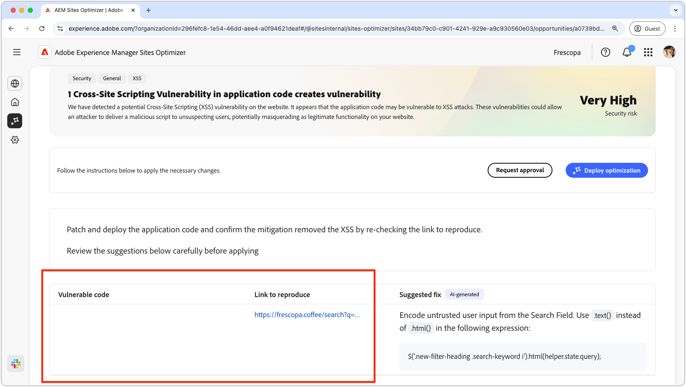

# Serveröverskridande skriptmöjligheter

{align="center"}

Serveröverskridande skriptmöjligheter (cross-site scripting) identifierar och åtgärdar säkerhetsluckor i koden som kan utnyttjas av angripare för att lägga in skadliga skript på webbsidor som visas av andra användare. Dessa skript kan stjäla känslig information, t.ex. sessionscookies, eller utföra åtgärder för användarens räkning, t.ex. ändra användarens lösenord.

## Automatisk identifiering

{align="center"}

* **Sårbar kod** - Kod som är sårbar för attacker med korsskriptning mellan webbplatser.
* **Länk att återskapa** - Länken till sidan där sårbarheten påträffades.

## Föreslå automatiskt

{align="center"}

* **Föreslagen korrigering** - Ett AI-genererat förslag på hur du ska åtgärda säkerhetsluckan.

## Optimera [!BADGE Ultimate] automatiskt{type=Positive tooltip="Ultimate"}

>[!BEGINTABS]

>[!TAB Distribuera optimering]

{{auto-optimize-deploy-optimization-slack}}

>[!TAB Begär godkännande]

{{auto-optimize-request-approval}}

>[!ENDTABS]
