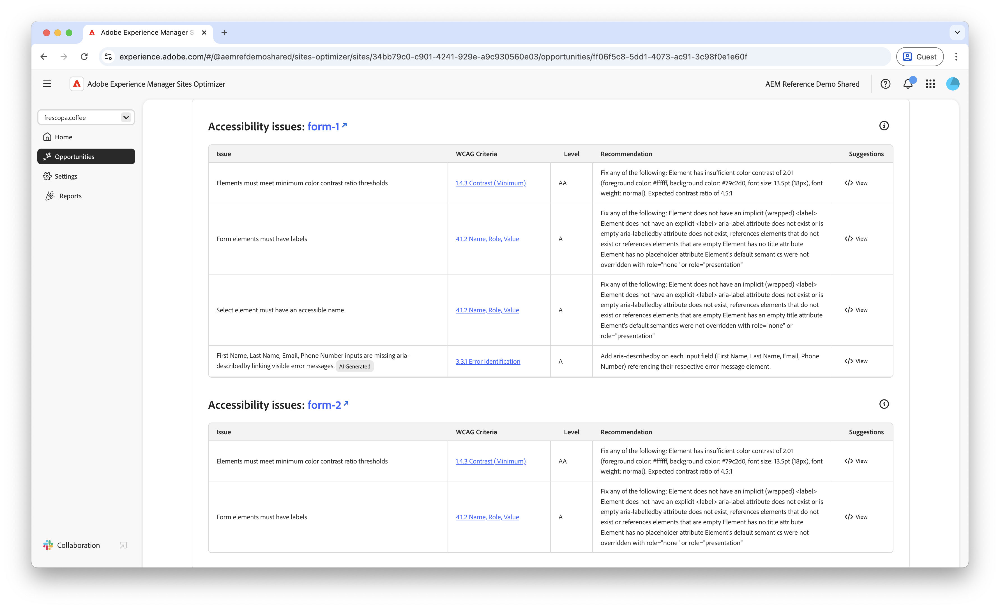
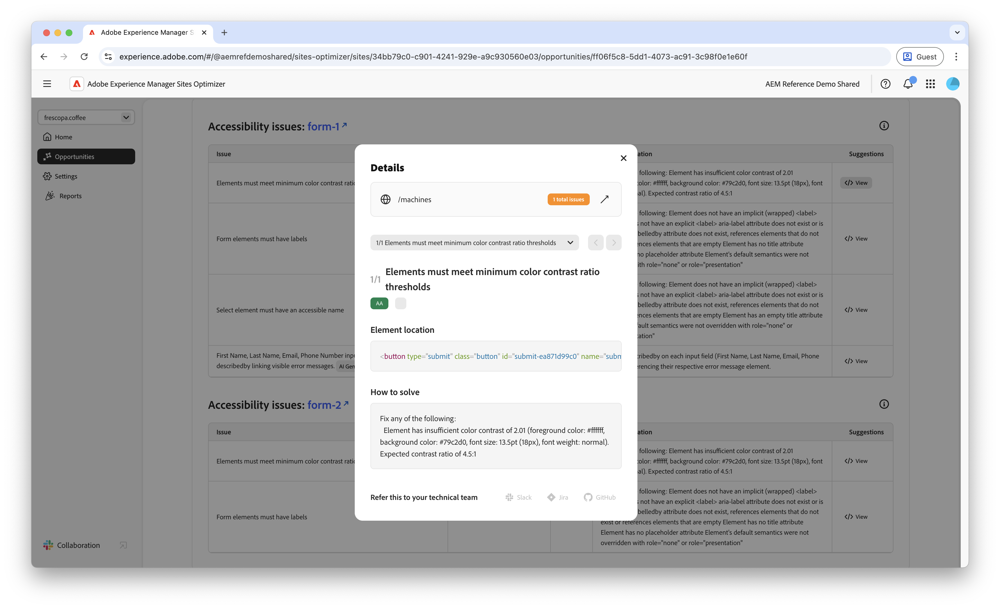

# Möjligheter till tillgänglighetsproblem i Forms

 Funktionen Forms Optimization är tillgänglig via programmet för tidig åtkomst. Du kan skriva till aem-forms-ea@adobe.com från ditt officiella e-post-id för att gå med i programmet för tidig åtkomst och begära åtkomst till funktionen. 

{align="center"}

Möjligheten att skapa tillgänglighetsproblem för formulär identifierar hur väl formulären uppfyller behoven hos personer med funktionshinder och om de följer [Web Content Accessibility Guidelines (WCAG)](https://www.w3.org/TR/WCAG21/). Genom att bedöma hur väl formulären överensstämmer med WCAG kan du skapa en heltäckande formulärupplevelse, som gör det möjligt för personer med nedsatt syn, hörsel, kognitiv och motorik att navigera i, interagera med och fylla i formulären. Detta är inte bara nödvändigt av etiska skäl, utan det främjar också efterlevnad av juridiska krav, förbättrar antalet ifyllda formulär och kan öka målgruppens räckvidd, vilket förbättrar både användarupplevelsen och affärsprestandan.

## Automatisk identifiering

{align="center"}

I **Forms tillgänglighetsproblem** identifieras tillgänglighetsproblem specifikt i formulären och följande ingår:

* **Problem** - Det specifika tillgänglighetsproblemet i formulären.
* **WCAG-villkor** - ID:t [WCAG-riktlinjer](https://www.w3.org/TR/WCAG21/) som formulärproblemet bryter mot.
* **Level** - [Levels of Conformance](https://www.w3.org/WAI/WCAG21/Understanding/conformance#levels) för problemet.
* **Rekommendation** - Specifik vägledning om hur du åtgärdar tillgänglighetsproblemet i dina formulär, inklusive kodexempel och metodtips.
* **Source HTML** - HTML-fragmentet för formulärelementet på sidan som påverkas av problemet.

## Föreslå automatiskt

{align="center"}

Automatiskt förslag ger AI-genererade rekommendationer i fältet **Föreskrifter**, som ger prediktiv vägledning om vad som ska göras för att åtgärda formulärtillgänglighetsproblemet.

<!-- 

## Auto-optimize

[!BADGE Ultimate]{type=Positive tooltip="Ultimate"}

{align="center"}

Sites Optimizer Ultimate adds the ability to deploy auto-optimization for the form accessibility issues found.

>[!BEGINTABS]

>[!TAB Deploy optimization]

{{auto-optimize-deploy-optimization-slack}}

>[!TAB Request approval]

{{auto-optimize-request-approval}}

>[!ENDTABS]
-->

