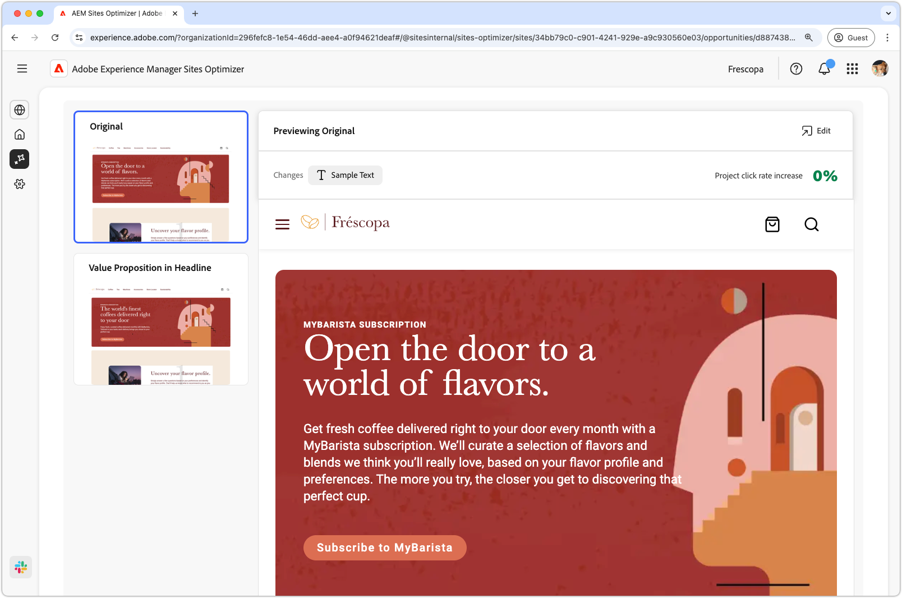

# Möjligheter med hög studentfrekvens

{align="center"}

Den höga studsfrekvensen identifierar formulär på er webbplats som har en hög avhoppsfrekvens. Denna möjlighet hjälper er att förstå vilka formulär som inte fungerar bra och ger förslag på hur ni kan förbättra deras engagemangsgrad. Genom att optimera formulärvyerna kan du öka antalet formulärinskickade formulär och förbättra webbplatsens övergripande prestanda.

## Automatisk identifiering

{align="center"}

Varje webbsida med ett formulär med låga vyer listas som en egen möjlighet med en **hög avhoppsfrekvens** . En kort sammanfattning av affärsmöjligheten och AI-logiken visas högst upp på affärsmöjlighetssidan.

## Föreslå automatiskt

{align="center"}

Automatiskt förslag innehåller AI-genererade webbsidesvarianter som är utformade för att öka visningen av formulären. Varje variation visar ökning av konverteringsgraden för **projekt** baserat på dess potential att förbättra formulärengagemanget, vilket hjälper dig att prioritera de mest effektiva förslagen.

>[!BEGINTABS]

>[!TAB Kontrollvariation]

{align="center"}

Kontrollvarianten är det ursprungliga formulär som för närvarande finns på webbplatsen. Den här variationen används som baslinje för att jämföra prestanda för de föreslagna variationerna.

>[!TAB Föreslagna varianter]

{align="center"}

De föreslagna variationerna är AI-genererade webbsidesvarianter som är utformade för att minska formulärets studsfrekvens. Varje variation visar den **projicerade klickhastighetsökningen** baserat på dess potential att förbättra formulärengagemanget, vilket hjälper dig att prioritera de mest effektiva förslagen.

Klicka på varje variant för att förhandsgranska den till höger på skärmen. Överst i förhandsgranskningen finns följande åtgärder och information:

* **Ändringar** - en kort sammanfattning av vad som ändrats i den här variationen från varianten **Kontroll**.
* **Prognos för klickfrekvens** - Den uppskattade ökningen av klickfrekvensen om den här variationen implementeras.
* **Redigera** - Klicka för att redigera varianten i AEM-redigeringen.

>[!ENDTABS]

## Optimera [!BADGE Ultimate] automatiskt{type=Positive tooltip="Ultimate"}

{align="center"}

Sites Optimizer Ultimate lägger till möjligheten att automatiskt optimera för problem som kan uppstå vid visning i lågdager.

>[!BEGINTABS]

>[!TAB Testa flera]

>[!TAB Publicera markerade]

{{auto-optimize-deploy-optimization-slack}}

>[!TAB Begär godkännande]

{{auto-optimize-request-approval}}

>[!ENDTABS]
