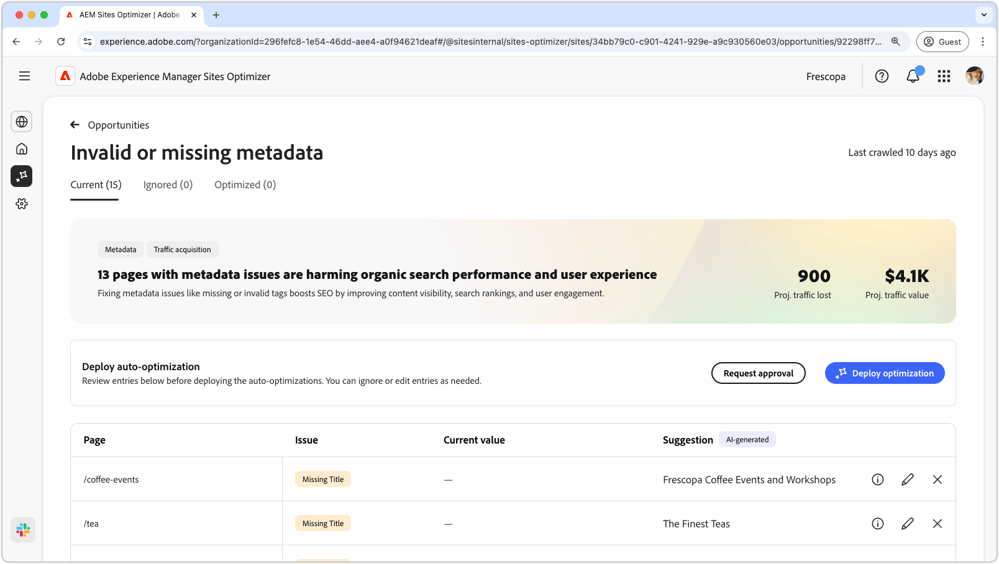
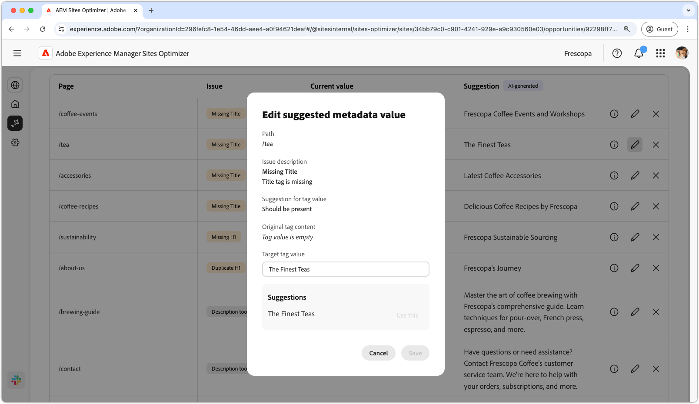
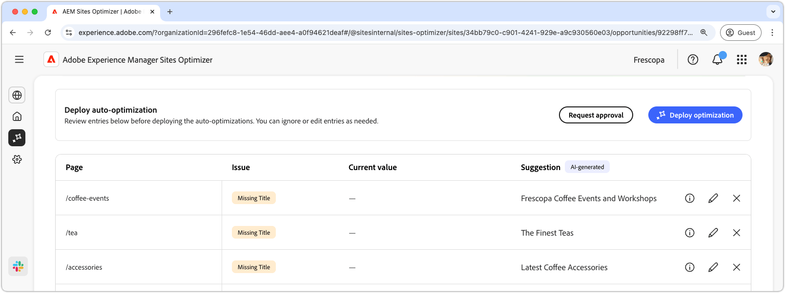

# Ogiltig eller saknad metadatamöjlighet

{align="center"}

Den ogiltiga eller saknade metadatamöjligheten identifierar saknade eller felaktiga metadata på dina webbsidor. Genom att åtgärda metadataproblem får SEO förbättrats genom bättre synlighet för innehåll, sökrankningar och användarengagemang. Dessa problem kan bero på faktorer som saknade eller ogiltiga taggar, för långa eller för korta beskrivningar osv.

Den ogiltiga eller saknade metadatamöjligheten visar en sammanfattning högst upp på sidan, inklusive en sammanfattning av problemet och dess påverkan på webbplatsen och verksamheten.

* **Prognostiserad trafik förlorad** - Den beräknade trafikförlusten på grund av felaktiga metadata.
* **Planerat trafikvärde** - Det uppskattade värdet av förlorad trafik.

## Automatisk identifiering

{align="center"}

I de ogiltiga eller saknade metadatamöjligheterna listas alla felaktiga metadata på dina sidor, och de innehåller följande:

* **Sida** - Sidan som innehåller ogiltiga eller saknade metadata.
* **Problem** - Anger vilken typ av problem som påverkar metadatataggen. Dessa kan omfatta allt från saknade titlar till dubbletter av H1 och så vidare.
* **Värde** - Det aktuella metadatataggsvärdet som måste ändras.
* **Förslag** - Ett AI-genererat förslag på lämpliga tagguppdateringar. Mer information finns i avsnittet nedan.

## Föreslå automatiskt

{align="center"}

Den ogiltiga eller saknade metadatamöjligheten ger även AI-genererade förslag på hur metadatataggar ska ändras eller uppdateras. Dessa förslag baseras på den inledande taggen som innehåller felaktiga metadata och innehållet i den föreslagna uppdateringen.

>[!BEGINTABS]

>[!TAB AI-logik]

Om du väljer **informationsikonen** visas AI-logiken för den föreslagna uppdateringen.

>[!TAB  Redigera föreslaget metadatavärde ]

{align="center"}

Om du inte håller med om det AI-genererade förslaget kan du redigera det föreslagna metadatavärdet genom att välja **redigeringsikonen**. På så sätt kan du manuellt ange det värde som du tror passar bäst för metadata. Redigeringsfönstret innehåller följande:

* **Sökväg** - Sökvägen till sidan som innehåller metadata (eller brist på).
* **Utfärdandebeskrivning** - Anger den typ av problem som påverkar metadatataggen och en kort beskrivning.
* **Förslag för taggvärde** - Det AI-genererade förslaget om hur metadatataggen ska ändras eller uppdateras. Exempel: hur många tecken ska tagguppdateringen innehålla och så vidare.
* **Ursprungligt tagginnehåll** - det ursprungliga taggvärdet.
* **Måltaggvärde** - Redigera det här fältet och lägg till det önskade taggvärdet manuellt. När du väljer **Spara** är det här värdet som kommer att användas för den föreslagna uppdateringen.
* **Förslag** - Det AI-genererade förslaget om hur du ändrar värdet.
* **Spara** - Sparar och använder värdet i fältet **Måltagg**.

>[!TAB Ignorera poster]

Du kan välja att ignorera poster med målbrutna eller ogiltiga metadata. Om du väljer ikonen **Ignorera** tas posten bort från affärsmöjlighetslistan. Ignorerade poster kan återkopplas från fliken **Ignorerad** högst upp på affärsmöjlighetssidan.

>[!ENDTABS]

## Optimera [!BADGE Ultimate] automatiskt{type=Positive tooltip="Ultimate"}

{align="center"}

Sites Optimizer Ultimate lägger till möjligheten att automatiskt optimera för problem som uppstår i en ogiltig eller saknad metadatamöjlighet. <!--- TBD-need more in-depth and opportunity specific information here. What does the auto-optimization do?-->

>[!BEGINTABS]

>[!TAB Distribuera optimering]

{{auto-optimize-deploy-optimization-slack}}

>[!TAB Begär godkännande]

{{auto-optimize-request-approval}}

>[!ENDTABS]
