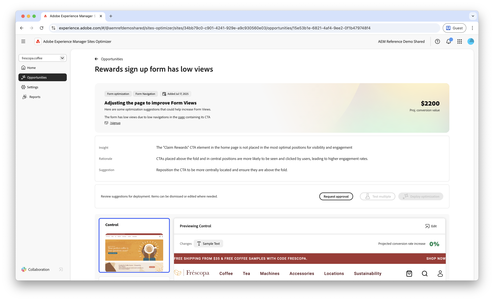
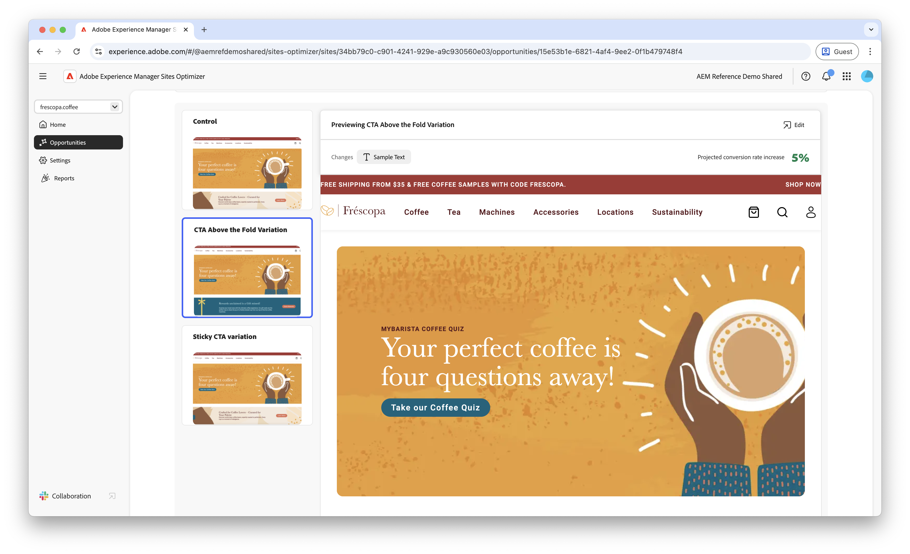
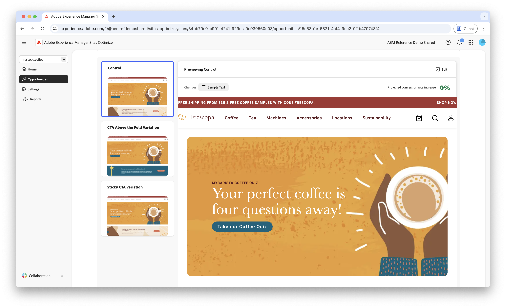

# Forms low navigation possibilities

 Funktionen Forms Optimization är tillgänglig via programmet för tidig åtkomst. Du kan skriva till aem-forms-ea@adobe.com från ditt officiella e-post-id för att gå med i programmet för tidig åtkomst och begära åtkomst till funktionen. 

{align="center"}

Den låga navigeringsmöjligheten identifierar formulär på webbplatsen som har låga navigeringsfrekvenser. Den här typen av affärsmöjlighet hjälper dig att förstå vilka formulär som inte identifieras eller nås av användare och ger förslag på hur de kan identifieras bättre.

## Automatisk identifiering

{align="center"}

Varje webbsida med formulär med låg navigering visas som en egen **låg navigeringsmöjlighet** . En kort sammanfattning av affärsmöjligheten och logiken visas högst upp på affärsmöjlighetssidan.

## Föreslå automatiskt

Automatiskt förslag innehåller AI-genererade formulärvarianter som är utformade för att öka navigeringen i formulären. Varje variation visar den **beräknade konverteringsgraden ökning** baserat på dess potential att förbättra formuläridentifieringen och tillgängligheten, vilket hjälper dig att prioritera de mest effektiva förslagen.

>[!BEGINTABS]

>[!TAB Kontrollvariation]

{align="center"}

Kontrollvariationen är de originalformulär som för närvarande finns på webbplatsen. Den här variationen används som baslinje för att jämföra prestanda för de föreslagna variationerna.

>[!TAB Föreslagna varianter]

{align="center"}

De föreslagna variationerna är AI-genererade formulärvarianter som är utformade för att öka navigeringen i formulären. Varje variation visar den **beräknade konverteringsgraden ökning** baserat på dess potential att förbättra formuläridentifieringen och tillgängligheten, vilket hjälper dig att prioritera de mest effektiva förslagen.

Klicka på varje variant för att förhandsgranska den till höger på skärmen. Överst i förhandsgranskningen finns följande åtgärder och information:

* **Ändringar** - en kort sammanfattning av vad som ändrats i den här variationen från varianten **Kontroll**.
* **Planerad ökning av konverteringsgraden** - Den uppskattade ökningen av formulärengagemanget om den här variationen implementeras.
* **Redigera** - Klicka för att redigera varianten i AEM-redigeringen.

>[!ENDTABS]

<!-- 

## Auto-optimize

[!BADGE Ultimate]{type=Positive tooltip="Ultimate"}

{align="center"}

Sites Optimizer Ultimate adds the ability to deploy auto-optimization for the issues found by the low navigation opportunity.

>[!BEGINTABS]

>[!TAB Test multiple]

>[!TAB Publish selected]

{{auto-optimize-deploy-optimization-slack}}

>[!TAB Request approval]

{{auto-optimize-request-approval}}

>[!ENDTABS]

-->
