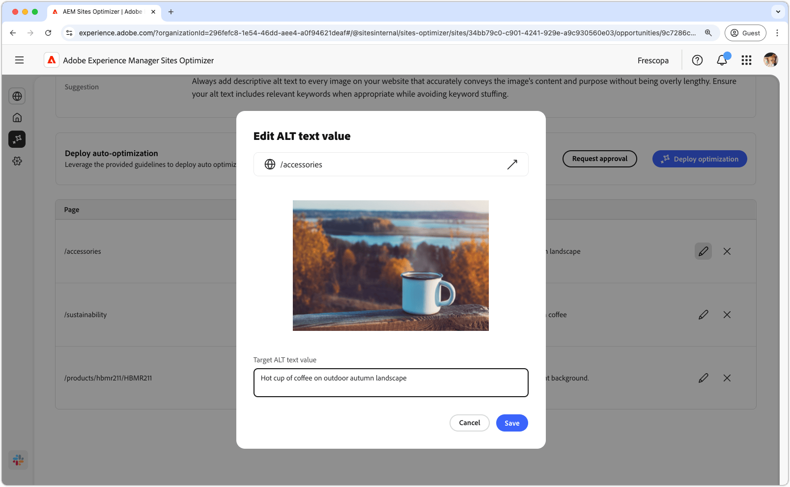

# Alternativ text saknas

{align="center"}

Det saknade ALT-texttillfället identifierar bilder utan beskrivande alternativ text på webbplatsen. Sökmotorer kan inte indexera eller förstå bilder korrekt utan alternativ text. Den här funktionen minskar innehållets upptäckbarhet och rankning, vilket i slutänden begränsar er målgrupps räckvidd. Om du inte har Alt-text för bilder exkluderas personer med nedsatt syn som behöver skärmläsare för att förstå webbinnehåll, vilket effektivt skapar hinder för åtkomst till information.

Den saknade alt text-möjligheten visar en sammanfattning högst upp på sidan, inklusive en sammanfattning av problemet och dess påverkan på din webbplats och ditt företag.

* **Prognostiserad trafikförlust** - Den beräknade trafikförlusten på grund av Alt-texten som saknas.
* **Planerat trafikvärde** - Det uppskattade värdet av förlorad trafik.

Det finns också ett annat fält som visar logiken, insikten och förslagen som rör affärsmöjligheten.

## Automatisk identifiering

{align="center"}

I det saknade alternativtextfältet visas alla bilder på webbplatsen som saknar alternativ text. Det här avsnittet innehåller följande kategorier:

* **Sida** - Sökvägen till sidan som innehåller den saknade alt-texten.
* **Bild** - Den bild som saknar den beskrivande alt-texten.
* **Förslag** - Ett AI-genererat förslag för alternativ text.

## Föreslå automatiskt

{align="center"} som saknas

Automatiskt förslag ger AI-genererade förslag på alternativ text i bilderna. De AI-genererade förslagen är utformade för att hjälpa dig att snabbt lägga till alternativ text till bilder utan att behöva analysera varje bild manuellt.

>[!BEGINTABS]

>[!TAB Redigera Alt-text som saknas]

{align="center"}

Om du inte håller med om det AI-genererade förslaget kan du redigera den föreslagna alternativa texten genom att välja **redigeringsikonen**. Med den här funktionen kan du manuellt justera den text som du tror passar bäst för bilden. Redigeringsfönstret innehåller följande:

* **Sidsökväg** - Ett skrivskyddat fält som visar sökvägen till sidan där alt-textproblem saknas. Klicka på pilen bredvid banan för att öppna motsvarande sida.
* **Bild** - En skrivskyddad förhandsvisning av bilden som kräver alternativ text.
* **Mål-ALT-text** - Ett redigerbart fält där du manuellt kan ange en beskrivande alternativ text för bilden. Se till att Alt-texten tydligt anger bildens innehåll och syfte. När det är relevant, ta med nyckelord naturligt utan att överlagra dem.

>[!TAB Ignorera poster]

Du kan välja att ignorera poster i affärsmöjlighetslistan. Om du väljer  tas posten bort från listan. Ignorerade poster kan återkopplas från fliken **Ignorerad** högst upp på affärsmöjlighetssidan.

>[!ENDTABS]

## Automatisk optimering

[!BADGE Ultimate]{type=Positive tooltip="Ultimate"}

{align="center"}

Sites Optimizer Ultimate lägger till möjligheten att automatiskt optimera för de problem som uppstår i den saknade alternativtextmöjligheten. <!--- TBD-need more in-depth and opportunity specific information here. What does the auto-optimization do?-->

>[!BEGINTABS]

>[!TAB Distribuera optimering]

{{auto-optimize-deploy-optimization-slack}}

>[!TAB Begär godkännande]

{{auto-optimize-request-approval}}

>[!ENDTABS]
