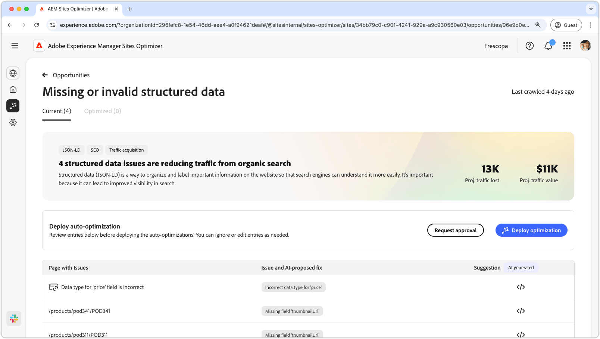

# Möjlighet till saknade eller ogiltiga strukturerade data

{align="center"}

Den saknade eller ogiltiga strukturerade datamöjligheter identifierar saknade eller felaktiga strukturerade data i det standardiserade Json-LD-formatet. Strukturerade data är ett sätt att ordna, beskriva och etikettera viktig information på din webbplats. Det hjälper sökmotorer att tolka innehållet på sidorna och leder till ökad synlighet i sökresultaten. Bättre sökresultat kan leda till att fler användare engagerar din webbplats.

Den saknade eller ogiltiga strukturerade datamöjligheten visar en sammanfattning högst upp på sidan, inklusive en sammanfattning av problemet och dess inverkan på er webbplats och verksamhet.

* **Prognostiserad trafikförlust** - Den beräknade trafikförlusten på grund av felaktiga strukturerade data.
* **Planerat trafikvärde** - Det uppskattade värdet av förlorad trafik.

## Automatisk identifiering

{align="center"}

I affärsmöjligheten för saknade eller ogiltiga strukturerade data listas alla problem som identifierats på dina sidor, och den innehåller följande kategorier:

* **Sida med problem** - Sidan som innehåller ogiltiga eller saknade strukturerade data.
* **Problem och AI-föreslagen korrigering** - Anger vilken typ av strukturerat dataproblem som påverkar sidan.
* **Förslag** - Ett AI-genererat förslag på lämpliga strukturerade datauppdateringar. Mer information finns i avsnittet nedan.

## Föreslå automatiskt

{align="center"}

Den ogiltiga eller saknade strukturerade datamöjligheter ger även AI-genererade förslag på hur man ändrar eller uppdaterar strukturerade data. När du klickar på knappen Förslag visas ett nytt fönster som innehåller följande:

* **Sidsökväg** - Ett fält som innehåller sökvägen till sidan med ogiltiga eller saknade strukturerade data.
* **Problem** - Ett fält som innehåller antalet problem och en listruta som listar alla problem.
* **förslagsfält** - En AI-genererad beskrivning och förslag på lämpliga strukturerade datauppdateringar. Du kan bläddra nedåt för ytterligare förslag och problem.

## Automatisk optimering

[!BADGE Ultimate]{type=Positive tooltip="Ultimate"}

{align="center"}

Sites Optimizer Ultimate lägger till möjligheten att automatiskt optimera för problem som uppstår vid ogiltiga eller saknade strukturerade datamöjligheter. <!--- TBD-need more in-depth and opportunity specific information here. What does the auto-optimization do?-->

>[!BEGINTABS]

>[!TAB Distribuera optimering]

{{auto-optimize-deploy-optimization-slack}}

>[!TAB Begär godkännande]

{{auto-optimize-request-approval}}

>[!ENDTABS]
