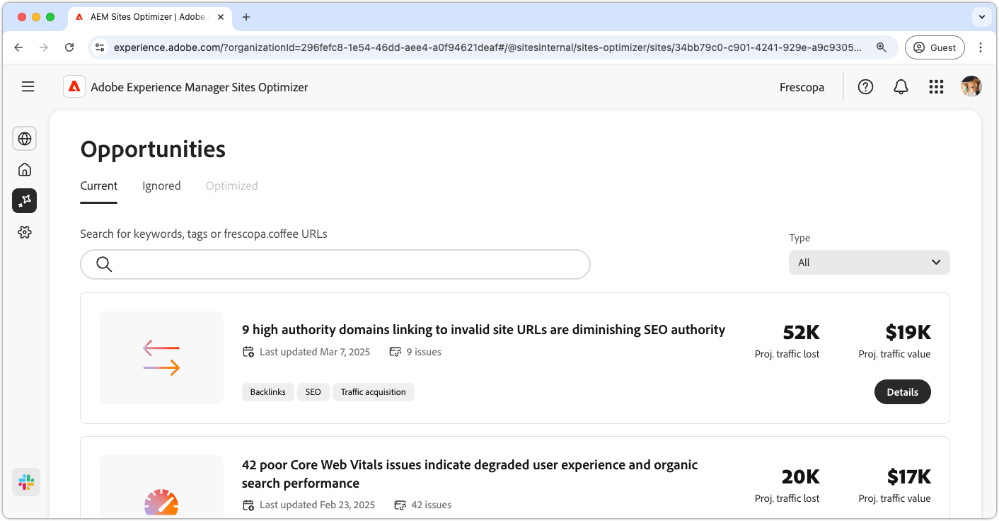

# Dokumentation om affärsmöjligheter

{align="center"}

Sites Optimizer utgörs av en ständigt växande uppsättning möjligheter som bygger på Adobe AI, som är utformade för att identifiera och föreslå förbättringar för er webbplats. Varje möjlighet ger insikter om det potentiella affärsvärdet, lyfter fram områden som behöver åtgärdas och ger användbara rekommendationer för optimering. Klicka på varje tillfälle för att utforska identifierade problem, föreslagna förbättringar och stegvis vägledning om hur du implementerar dessa ändringar för att få bättre webbplatsprestanda och användarupplevelse.

Möjligheter är tillgängliga via menyalternativet **Affärsmöjligheter** i [Platsoptimerarens beständiga navigering](/help/documentation/basics.md#navigation).

## Status för affärsmöjlighet

Använd flikarna längst upp för att ordna och filtrera möjligheter efter status.

>[!BEGINTABS]

>[!TAB Aktuell]

{align="center"}

Affärsmöjligheter som väntar.

>[!TAB Ignorerad]

{align="center"}

Möjligheter som har ignorerats. Ignorerade möjligheter kan återställas från den här vyn.

>[!TAB Optimerad]

En historisk lista över möjligheter som har optimerats.

>[!ENDTABS]

## Möjligheter

Om du har markerat en [affärsmöjlighetsstatus](#opportunity-status) kan du visa en lista över affärsmöjligheter. Du kan filtrera listan över affärsmöjligheter på följande sätt:

* **Sök** - Sök efter affärsmöjligheter med **nyckelord, taggar eller URL:er**.
* **Affärsmöjlighetstyp** - Använd listrutan **Typ** för att filtrera affärsmöjligheter efter [affärsmöjlighetstyp](/help/opportunity-types/overview.md).

### Information om affärsmöjlighet

{align="center"}

Varje möjlighet ger en kort beskrivning av problemet, dess potentiella inverkan på er webbplats och en länk till fullständig information. Du kan också se dess status och ange om den har optimerats eller fortfarande väntar.

* **Affärsmöjlighetens titel** - En kort beskrivning av problemet och dess potentiella inverkan på webbplatsens prestanda.
* **Senast uppdaterad** - Sites Optimizer uppdaterade senast affärsmöjligheten med nya data detta datum.
* **Antal problem** - Antalet instanser av problemet som har identifierats på din webbplats.
* **Affärsmöjlighetstyper** - De [typer av affärsmöjlighet](/help/opportunity-types/overview.md) som den här affärsmöjligheten är en del av - till exempel trafikförvärv, engagemang, konvertering eller webbplatshälsa.

Sammanfattningsinformationen för varje affärsmöjlighet varierar beroende på typ och kan innehålla information om intäktseffekter, trafik, användarengagemang eller säkerhetshot.

Om du vill visa information om en affärsmöjlighet klickar du på knappen **Detaljer** .

Klicka på knappen **Ignorera** om du vill utesluta en affärsmöjlighet från Sites Optimizer kontrollpanel.  Den här åtgärden flyttar affärsmöjligheten till fliken [**Ignorerad**](#opportunity-status).

## Alla möjligheter

Utforska alla möjligheter i Sites Optimizer:

<!-- CARDS

* ./accessibility-issues.md
  {title=Accessibility issues}
  {image=../../assets/common/card-arrows.png} 
* ./broken-backlinks.md
  {title=Broken backlinks}
  {image=../../assets/common/card-arrows.png}
* ./broken-internal-links.md
  {title=Broken internal links}
  {image=../../assets/common/card-link.png}
* ./cors-configuration.md
  {title=CORS configuration}
  {image=../../assets/common/card-code.png}
* ./core-web-vitals.md
  {title=Core web vitals}
  {image=../../assets/common/card-performance.png}
* ./cross-site-scripting.md
  {title=Cross-site scripting}
  {image=../../assets/common/card-code.png}
* ./high-bounce-rate.md
  {title=High bounce rate}
  {image=../../assets/common/card-arrows.png}    
* ./invalid-or-missing-metadata.md
  {title=Invalid or missing metadata}
  {image=../../assets/common/card-code.png}
* ./low-conversions.md
  {title=Low conversions}
  {image=../../assets/common/card-bag.png}
* ./low-views.md
  {title=Low views}
  {image=../../assets/common/card-bag.png} 
* ./missing-alt-text.md
  {title=Missing alt text}
  {image=../../assets/common/card-arrows.png}
* ./missing-invalid-structured-data.md
  {title=Missing or invalid structured data}
  {image=../../assets/common/card-bag.png}
* ./sitemap-issues.md
  {title=Sitemap issues}
  {image=../../assets/common/card-relationship.png}
* ./website-permissions.md
  {title=Website permissions}
  {image=../../assets/common/card-people.png}
* ./website-vulnerabilities.md
  {title=Website vulnerabilities}
  {image=../../assets/common/card-puzzle.png}
  
--->
<!-- START CARDS HTML - DO NOT MODIFY BY HAND -->

    

        

            

                <figure class="image x-is-16by9">
                    
                </figure>
            

            

                

                    

                        <a href="./accessibility-issues.md" target="_blank" rel="referrer" title="Tillgänglighetsfrågor">Hjälpmedelsproblem</a>
                    

                    
Läs mer om möjligheterna med tillgänglighet och hur du använder den för att öka säkerheten på din webbplats.

                

                <a href="./accessibility-issues.md" target="_blank" rel="referrer" class="spectrum-Button spectrum-Button--outline spectrum-Button--primary spectrum-Button--sizeM" style="align-self: flex-start; margin-top: 1rem;">
                    Läs mer
                </a>
            

        

    

    

        

            

                <figure class="image x-is-16by9">
                    
                </figure>
            

            

                

                    

                        <a href="./broken-backlinks.md" target="_blank" rel="referrer" title="Brutna bakterier">Brutna baklänkar</a>
                    

                    
Lär dig mer om den brutna bakåtlänksmöjligheten och hur du kan använda den för att förbättra trafikförvärvet.

                

                <a href="./broken-backlinks.md" target="_blank" rel="referrer" class="spectrum-Button spectrum-Button--outline spectrum-Button--primary spectrum-Button--sizeM" style="align-self: flex-start; margin-top: 1rem;">
                    Läs mer
                </a>
            

        

    

    

        

            

                <figure class="image x-is-16by9">
                    
                </figure>
            

            

                

                    

                        <a href="./broken-internal-links.md" target="_blank" rel="referrer" title="Brutna interna länkar">Brutna interna länkar</a>
                    

                    
Lär dig mer om de brutna länkarna och hur du kan använda dem för att förbättra engagemanget på din webbplats.

                

                <a href="./broken-internal-links.md" target="_blank" rel="referrer" class="spectrum-Button spectrum-Button--outline spectrum-Button--primary spectrum-Button--sizeM" style="align-self: flex-start; margin-top: 1rem;">
                    Läs mer
                </a>
            

        

    

    

        

            

                <figure class="image x-is-16by9">
                    
                </figure>
            

            

                

                    

                        <a href="./cors-configuration.md" target="_blank" rel="referrer" title="CORS-konfiguration">CORS-konfiguration</a>
                    

                    
Lär dig mer om CORS konfigurationsmöjlighet och att identifiera och åtgärda säkerhetsluckor på platsen.

                

                <a href="./cors-configuration.md" target="_blank" rel="referrer" class="spectrum-Button spectrum-Button--outline spectrum-Button--primary spectrum-Button--sizeM" style="align-self: flex-start; margin-top: 1rem;">
                    Läs mer
                </a>
            

        

    

    

        

            

                <figure class="image x-is-16by9">
                    
                </figure>
            

            

                

                    

                        <a href="./core-web-vitals.md" target="_blank" rel="referrer" title="Core web vitals">Core web vitals</a>
                    

                    
Läs om de viktigaste möjligheterna med webbartiklar och hur ni kan använda dem för att förbättra trafikförvärvet.

                

                <a href="./core-web-vitals.md" target="_blank" rel="referrer" class="spectrum-Button spectrum-Button--outline spectrum-Button--primary spectrum-Button--sizeM" style="align-self: flex-start; margin-top: 1rem;">
                    Läs mer
                </a>
            

        

    

    

        

            

                <figure class="image x-is-16by9">
                    
                </figure>
            

            

                

                    

                        <a href="./cross-site-scripting.md" target="_blank" rel="referrer" title="Serveröverskridande skript">Serveröverskridande skript</a>
                    

                    
Läs mer om cross-site scripting och att identifiera och åtgärda säkerhetsluckor.

                

                <a href="./cross-site-scripting.md" target="_blank" rel="referrer" class="spectrum-Button spectrum-Button--outline spectrum-Button--primary spectrum-Button--sizeM" style="align-self: flex-start; margin-top: 1rem;">
                    Läs mer
                </a>
            

        

    

    

        

            

                <figure class="image x-is-16by9">
                    
                </figure>
            

            

                

                    

                        <a href="./high-bounce-rate.md" target="_blank" rel="referrer" title="Hög studsfrekvens">Hög studsfrekvens</a>
                    

                    
Läs mer om möjligheterna med låga vyer och hur ni kan använda dem för att förbättra engagemanget för formulär på er webbplats.

                

                <a href="./high-bounce-rate.md" target="_blank" rel="referrer" class="spectrum-Button spectrum-Button--outline spectrum-Button--primary spectrum-Button--sizeM" style="align-self: flex-start; margin-top: 1rem;">
                    Läs mer
                </a>
            

        

    

    

        

            

                <figure class="image x-is-16by9">
                    
                </figure>
            

            

                

                    

                        <a href="./invalid-or-missing-metadata.md" target="_blank" rel="referrer" title="Ogiltiga eller saknade metadata">Ogiltiga eller saknade metadata</a>
                    

                    
Lär dig mer om ogiltiga eller saknade metadatamöjligheter och hur du kan använda dem för att förbättra trafikförvärvet.

                

                <a href="./invalid-or-missing-metadata.md" target="_blank" rel="referrer" class="spectrum-Button spectrum-Button--outline spectrum-Button--primary spectrum-Button--sizeM" style="align-self: flex-start; margin-top: 1rem;">
                    Läs mer
                </a>
            

        

    

        

            

                <figure class="image x-is-16by9">
                    
                </figure>
            

            

                

                    

                        <a href="./low-conversions.md" target="_blank" rel="referrer" title="Forms low convertions">Låga Forms-konverteringar</a>
                    

                    
Läs om möjligheterna till låga konverteringsgrader och hur ni kan använda dem för att förbättra engagemanget på era webbplatser.

                

                <a href="./low-conversions.md" target="_blank" rel="referrer" class="spectrum-Button spectrum-Button--outline spectrum-Button--primary spectrum-Button--sizeM" style="align-self: flex-start; margin-top: 1rem;">
                    Läs mer
                </a>
            

        

    

    

        

            

                <figure class="image x-is-16by9">
                    
                </figure>
            

            

                

                    

                        <a href="./low-views.md" target="_blank" rel="referrer" title="Låga vyer">Låga Forms-vyer</a>
                    

                    
Läs mer om formulärens låga visningsmöjligheter och hur ni kan använda dem för att förbättra formulärengagemanget på er webbplats.

                

                <a href="./low-views.md" target="_blank" rel="referrer" class="spectrum-Button spectrum-Button--outline spectrum-Button--primary spectrum-Button--sizeM" style="align-self: flex-start; margin-top: 1rem;">
                    Läs mer
                </a>
            

        

    

    

        

            

                <figure class="image x-is-16by9">
                    
                </figure>
            

            

                

                    

                        <a href="./low-navigation.md" target="_blank" rel="referrer" title="Forms low navigation">Forms låg navigering</a>
                    

                    
Lär dig mer om den låga navigeringsmöjligheten och hur du kan använda den för att förbättra formulärengagemanget på din webbplats.

                

                <a href="./low-navigation.md" target="_blank" rel="referrer" class="spectrum-Button spectrum-Button--outline spectrum-Button--primary spectrum-Button--sizeM" style="align-self: flex-start; margin-top: 1rem;">
                    Läs mer
                </a>
            

        

    

    

        

            

                <figure class="image x-is-16by9">
                    
                </figure>
            

            

                

                    

                        <a href="./forms-accessibility-issues.md" target="_blank" rel="referrer" title="Forms tillgänglighetsproblem">Forms tillgänglighetsproblem</a>
                    

                    
Läs mer om tillgänglighetsproblemen i Forms och hur ni kan använda dem för att förbättra engagemanget på er webbplats.

                

                <a href="./forms-accessibility-issues.md" target="_blank" rel="referrer" class="spectrum-Button spectrum-Button--outline spectrum-Button--primary spectrum-Button--sizeM" style="align-self: flex-start; margin-top: 1rem;">
                    Läs mer
                </a>
            

        

    

    

        

            

                <figure class="image x-is-16by9">
                    
                </figure>
            

            

                

                    

                        <a href="./missing-alt-text.md" target="_blank" rel="referrer" title="Alt-text saknas">Alt-text saknas</a>
                    

                    
Lär dig mer om den saknade alternativa textmöjligheten och hur du kan använda den för att förbättra engagemanget på din webbplats.

                

                <a href="./missing-alt-text.md" target="_blank" rel="referrer" class="spectrum-Button spectrum-Button--outline spectrum-Button--primary spectrum-Button--sizeM" style="align-self: flex-start; margin-top: 1rem;">
                    Läs mer
                </a>
            

        

    

    

        

            

                <figure class="image x-is-16by9">
                    
                </figure>
            

            

                

                    

                        <a href="./missing-invalid-structured-data.md" target="_blank" rel="referrer" title="Saknade eller ogiltiga strukturerade data">Ogiltiga strukturerade data saknas</a>
                    

                    
Lär dig mer om den saknade eller ogiltiga strukturerade datamöjligheter och hur du kan använda den för att förbättra trafikförvärvet.

                

                <a href="./missing-invalid-structured-data.md" target="_blank" rel="referrer" class="spectrum-Button spectrum-Button--outline spectrum-Button--primary spectrum-Button--sizeM" style="align-self: flex-start; margin-top: 1rem;">
                    Läs mer
                </a>
            

        

    

    

        

            

                <figure class="image x-is-16by9">
                    
                </figure>
            

            

                

                    

                        <a href="./sitemap-issues.md" target="_blank" rel="referrer" title="Problem med webbplatskarta">Problem med webbplatskarta</a>
                    

                    
Lär dig mer om möjligheterna med webbplatskartor och hur du kan använda den för att förbättra trafikförvärvet.

                

                <a href="./sitemap-issues.md" target="_blank" rel="referrer" class="spectrum-Button spectrum-Button--outline spectrum-Button--primary spectrum-Button--sizeM" style="align-self: flex-start; margin-top: 1rem;">
                    Läs mer
                </a>
            

        

    

    

        

            

                <figure class="image x-is-16by9">
                    
                </figure>
            

            

                

                    

                        <a href="./website-permissions.md" target="_blank" rel="referrer" title="Webbplatsbehörigheter">Webbplatsbehörigheter</a>
                    

                    
Läs mer om möjligheterna till webbplatsbehörigheter och hur du använder dem för att öka säkerheten på din webbplats.

                

                <a href="./website-permissions.md" target="_blank" rel="referrer" class="spectrum-Button spectrum-Button--outline spectrum-Button--primary spectrum-Button--sizeM" style="align-self: flex-start; margin-top: 1rem;">
                    Läs mer
                </a>
            

        

    

    

        

            

                <figure class="image x-is-16by9">
                    
                </figure>
            

            

                

                    

                        <a href="./website-vulnerabilities.md" target="_blank" rel="referrer" title="Säkerhetsluckor på webbplatser">Säkerhetsluckor på webbplatser</a>
                    

                    
Läs mer om sårbarheterna på webbplatsen och hur du använder den för att öka säkerheten på din webbplats.

                

                <a href="./website-vulnerabilities.md" target="_blank" rel="referrer" class="spectrum-Button spectrum-Button--outline spectrum-Button--primary spectrum-Button--sizeM" style="align-self: flex-start; margin-top: 1rem;">
                    Läs mer
                </a>
            

        

    

<!-- END CARDS HTML - DO NOT MODIFY BY HAND -->

