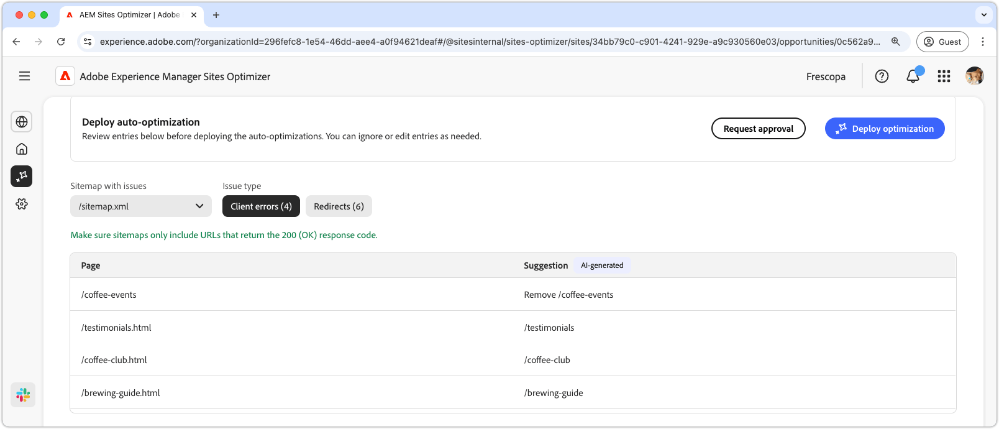

# Möjlighet att skapa webbplatskartor

{align="center"}

Med en komplett och korrekt webbplatskarta kan sökmotorer effektivt crawla och indexera webbsidor, vilket ger bättre synlighet i sökresultaten. Affärsmöjligheten på webbplatskartan identifierar potentiella problem med din webbplatskarta. Om du åtgärdar det här problemet kan sökmotorindexeringen och innehållsidentifieringen på din webbplats förbättras avsevärt.

En sammanfattning visas längst upp på sidan, med en sammanfattning av problemet och dess inverkan på webbplatsen och verksamheten.

* **Prognostiserad trafikförlust** - Den beräknade trafikförlusten på grund av platskartproblem.
* **Planerat trafikvärde** - Det uppskattade värdet av förlorad trafik.

## Automatisk identifiering

Problem med platskartor kan filtreras med följande kriterier:

* **Webbplatskarta med problem** - Den analyserade webbadressen för webbplatskartan som innehåller potentiella problem.
* **Ärendetyp** - Den typ av problem som identifieras i webbplatskartan:
   * **Klientfel** - Poster som inte returnerar ett `200 Success`-svar.
   * **Omdirigeringar** - Felaktiga eller felkonfigurerade omdirigeringar.

>[!BEGINTABS]

>[!TAB Klientfel]

{align="center"}

Om URL:er i din webbplatskarta returnerar dessa, kan sökmotorer anta att din platskarta är inaktuell eller att sidorna av misstag har tagits bort. Klienten anger att klientens (webbläsaren eller crawlaren) begäran var ogiltig. Vanliga är:

* **404 Det gick inte att hitta** - Den begärda sidan finns inte.
* **403 Ej tillåtet** - Servern nekar åtkomst till den begärda sidan.
* **410 Borttagen** - Sidan togs bort avsiktligt och kommer inte att returneras.
* **401 Oauktoriserad** - Autentisering krävs men har inte angetts.

Dessa fel kan skada SEO, särskilt om viktiga sidor returnerar **404 eller 410**, eftersom sökmotorer kan avindexera dem.

Varje problem visas i en tabell där kolumnen **Sida** identifierar den berörda platskartsposten:

* **Sida** - URL:en för webbplatskartposten med ett problem.

>[!TAB Omdirigeringar]

{align="center"}

Webbplatskartor ska bara innehålla slutliga mål-URL:er, inte sådana som omdirigeras. Omdirigeringar är avsedda att vägleda användare och crawler till rätt plats, men kan orsaka problem om de inte är konfigurerade:

* **302 Hittade (tillfällig omdirigering)** - Kan orsaka SEO-problem om de används av misstag i stället för **301**.
* **307 Temporär omdirigering** - Liknar 302 men bevarar HTTP-metoden.
* **Omdirigeringsslingor** - När en sida omdirigeras tillbaka till sig själv eller skapar en oändlig slinga.
* **Brutna omdirigeringar** - När en omdirigering leder till en icke-existerande eller 4xx-sida.

Varje problem visas i en tabell där kolumnen **Sida** identifierar den berörda platskartsposten:

* **Sida** - URL:en för webbplatskartposten med ett problem.

>[!ENDTABS]

## Föreslå automatiskt

Varje platskartproblem [ som uppfyller filtervillkoren ](#auto-identify) visas i en tabell med följande kolumner:

* **Sida** - URL:en för webbplatskartposten med ett problem.
* **Förslag** - Den rekommenderade korrigeringen för problemet.

Vanligtvis innehåller förslag en uppdaterad webbplatssökväg för att korrigera webbplatskartposten. I vissa fall kan de även ge mer detaljerade anvisningar, t.ex. specificera rätt omdirigeringsmål.

## Optimera [!BADGE Ultimate] automatiskt{type=Positive tooltip="Ultimate"}

{align="center"}

Sites Optimizer Ultimate ger också möjlighet att driftsätta automatiska optimeringar av webbplatskartor.

>[!BEGINTABS]

>[!TAB Distribuera optimering]

{{auto-optimize-deploy-optimization-slack}}

>[!TAB Begär godkännande]

{{auto-optimize-request-approval}}

>[!ENDTABS]
