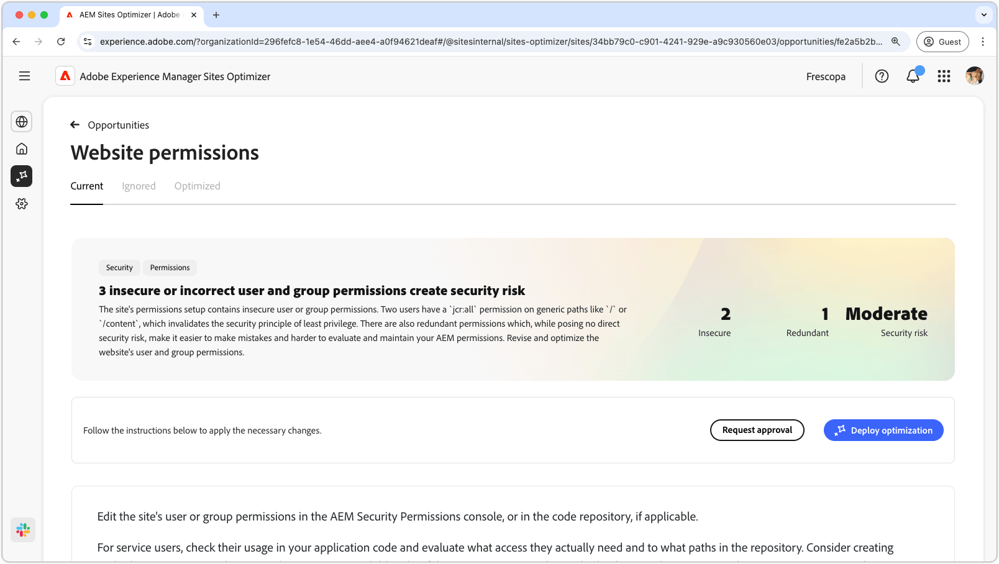

# Webbplatsbehörigheter - möjlighet

{align="center"}

Webbplatsbehörigheterna kan optimera webbplatsbehörigheter, vilket är avgörande för att en säker och hanterbar AEM-miljö ska kunna upprätthållas. Med den här möjligheten kan du förfina åtkomstkontroller genom att ta bort alltför breda behörigheter, som `jcr:all` på generiska sökvägar som `/` eller `/content`, och anpassa användaråtkomst till principen om minst behörighet. Genom att effektivisera behörigheter och eliminera redundans kan du minska säkerhetsriskerna, förbättra underhållet och förhindra framtida felkonfigurationer. Granska och uppdatera behörigheter i AEM Security Permissions console eller i koddatabasen. På så sätt får användarna bara den åtkomst de verkligen behöver.

## Automatisk identifiering

{align="center"}

Funktionen **Behörighetsmöjlighet** för webbplatser identifierar och visar automatiskt

* **Användare** - Användarkontot med osäker behörighet.
* **Sökväg** - Använd flikarna längst upp för att ordna och filtrera affärsmöjligheter efter status.
* **Behörighet** - Den misstänkta behörigheten.
* **Problem** - Anger vilken typ av problem som påverkar behörigheten.

## Föreslå automatiskt

{align="center"}

Automatiskt förslag ger AI-genererade rekommendationer i fältet **Föreslagna behörigheter**, så att du kan ersätta flaggade behörigheter med säkra alternativ.

## Automatisk optimering

[!BADGE Ultimate]{type=Positive tooltip="Ultimate"}

{align="center"}

Sites Optimizer Ultimate lägger till möjligheten att driftsätta automatisk optimering för de sårbarheter som hittas.

>[!BEGINTABS]

>[!TAB Distribuera optimering]

{{auto-optimize-deploy-optimization-slack}}

>[!TAB Begär godkännande]

{{auto-optimize-request-approval}}

>[!ENDTABS]
