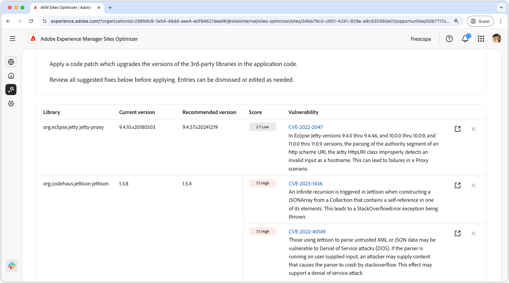

# Möjlighet till sårbarheter på webbplatser

{align="center"}

Webbplatsens sårbarheter identifierar säkerhetsluckor i tredjepartsbibliotek som används av programkoden. Säkerhetsluckorna kan utnyttjas av en angripare som ökar risken och minskar webbplatsens säkerhetsställning.

Webbplatsens sårbarheter innehåller en sammanfattning högst upp på sidan, inklusive följande:

* **Hittade problem** - Antal identifierade sårbarheter, kategoriserade efter den säkerhetsrisk de representerar (låg, medel, hög).
* **Aggregerad säkerhetsrisk** - Den övergripande säkerhetsrisken för din webbplats baserat på de sårbarheter som hittats av affärsmöjligheten.

## Automatisk identifiering

{align="center"}

Funktionen **Sårbarheter i webbplatser** identifierar och listar automatiskt säkerhetsluckor i tredjepartsbibliotek som används av programkoden. Den innehåller följande information:

* **Bibliotek** - Det tredjepartsbibliotek som innehåller säkerhetsluckan. Ett bibliotek kan ha flera sårbarheter.
* **Aktuell version** - Den version av biblioteket som används för närvarande.
* **Rekommenderad version** - Den föreslagna versionen som åtgärdar säkerhetsluckan.
* **Poäng** - Säkerhetsluckans allvarlighetsgrad, som också sammanfattas överst på sidan.
* **Sårbarhet** - Sårbarhets-ID:t, en kort beskrivning och en länk till NVD-databasen (National Vulnerability Database) om du vill ha mer information. Du når NVD-länken genom att klicka på identifieraren eller länken bredvid beskrivningen.

## Föreslå automatiskt

{align="center"}

Automatiskt förslag ger AI-genererade förslag för den **rekommenderade versionen** av det sårbara biblioteket som du bör uppgradera till. Varje post har en **bakgrundsmusik** som anger dess övergripande allvarlighetsgrad, vilket hjälper dig att prioritera de viktigaste säkerhetsluckorna.

>[!BEGINTABS]

>[!TAB Sårbarhetsinformation]

Varje säkerhetslucka innehåller en länk till den detaljerade informationen i [NVD (National Vulnerability Database)](https://nvd.nist.gov/). Om du klickar på säkerhetsidentifieraren eller länkobjektet till höger om beskrivningen kommer du till NVD-sidan för den säkerhetsluckan.

>[!TAB Ignorera poster]

Du kan välja att ignorera poster från listan över säkerhetsluckor. Om du väljer ikonen **Ignorera** tas posten bort från listan. Ignorerade poster kan återkopplas från fliken **Ignorerad** högst upp på affärsmöjlighetssidan.<!---right now it does not seem to be implemented, but the page description mentions this functionality-->

>[!ENDTABS]

## Optimera [!BADGE Ultimate] automatiskt{type=Positive tooltip="Ultimate"}

{align="center"}

Sites Optimizer Ultimate lägger till möjligheten att driftsätta automatisk optimering för de sårbarheter som hittas.

>[!BEGINTABS]

>[!TAB Distribuera optimering]

{{auto-optimize-deploy-optimization-slack}}

>[!TAB Begär godkännande]

{{auto-optimize-request-approval}}

>[!ENDTABS]