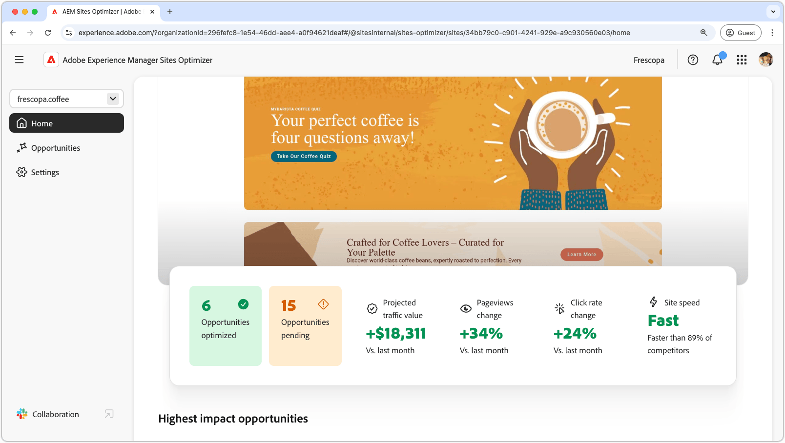

# Sites Optimizer-dokumentation

{align="center"}

Välkommen till dokumentationen för Sites Optimizer. Här finns information om hur du använder Sites Optimizer för att optimera dina AEM-webbplatser.

## Grundläggande om webbplatsoptimering

Utforska AEM Sites Optimizer dokumentation och lär dig mer om viktiga komponenter i användargränssnittet, som hempanelen, inställningskonfigurationer och säljprojektslistan för optimeringsinsikter.

<!-- CARDS 

* ./basics.md
  {title = Basics}
  {image = ./assets/basics/card.png}
* ./opportunities/overview.md
  {title = Opportunities}
* ./settings.md
  {title = Settings}

-->
<!-- START CARDS HTML - DO NOT MODIFY BY HAND -->

    

        

            

                <figure class="image x-is-16by9">
                    
                </figure>
            

            

                

                    

                        <a href="./basics.md" target="_blank" rel="referrer" title="Grunderna">Grunderna</a>
                    

                    
Lär dig grunderna i Sites Optimizer och hur du navigerar i det.

                

                <a href="./basics.md" target="_blank" rel="referrer" class="spectrum-Button spectrum-Button--outline spectrum-Button--primary spectrum-Button--sizeM" style="align-self: flex-start; margin-top: 1rem;">
                    Läs mer
                </a>
            

        

    

    

        

            

                <figure class="image x-is-16by9">
                    
                </figure>
            

            

                

                    

                        <a href="./opportunities/overview.md" target="_blank" rel="referrer" title="Möjligheter">Affärsmöjligheter</a>
                    

                    
Lär dig mer om alla tillgängliga möjligheter för webbplatsoptimering och hur du använder dem för att förbättra webbplatsens prestanda.

                

                <a href="./opportunities/overview.md" target="_blank" rel="referrer" class="spectrum-Button spectrum-Button--outline spectrum-Button--primary spectrum-Button--sizeM" style="align-self: flex-start; margin-top: 1rem;">
                    Läs mer
                </a>
            

        

    

    

        

            

                <figure class="image x-is-16by9">
                    
                </figure>
            

            

                

                    

                        <a href="./settings.md" target="_blank" rel="referrer" title="Inställningar">Inställningar</a>
                    

                    
Lär dig hur du konfigurerar Sites Optimizer-inställningar och integrerar med andra verktyg.

                

                <a href="./settings.md" target="_blank" rel="referrer" class="spectrum-Button spectrum-Button--outline spectrum-Button--primary spectrum-Button--sizeM" style="align-self: flex-start; margin-top: 1rem;">
                    Läs mer
                </a>
            

        

    

<!-- END CARDS HTML - DO NOT MODIFY BY HAND -->

