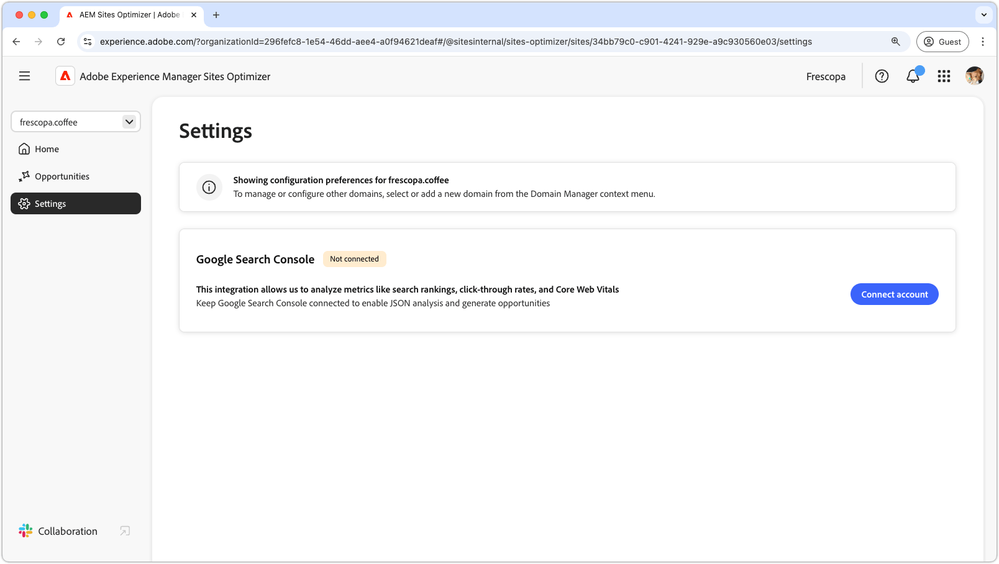

# Sites Optimizer-inställningar

{align="center"}

Inställningarna för webbplatsoptimering är navet för att konfigurera din Sites Optimizer-upplevelse.

## Google Search Console

{align="center"}

Inställningskonnektorn för Google Search Console i AEM Sites Optimizer gör det möjligt att analysera viktiga SEO-mått som sökrankningar, klickfrekvens och Core Web Vitals. Genom att hålla Google Search Console ansluten kan du utnyttja JSON-analys för att identifiera optimeringsmöjligheter och förbättra webbplatsens prestanda.

Om du vill konfigurera den här kopplingen måste du ha autentiseringsuppgifter med administrativ åtkomst till Google Search Console för domänen.
