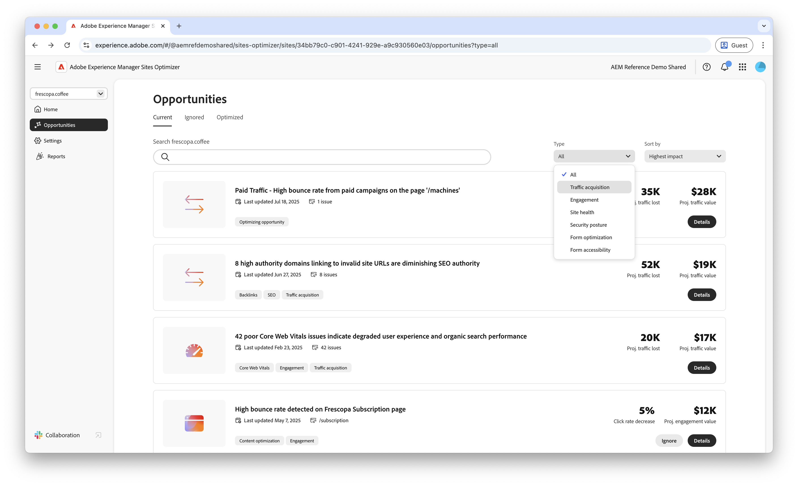
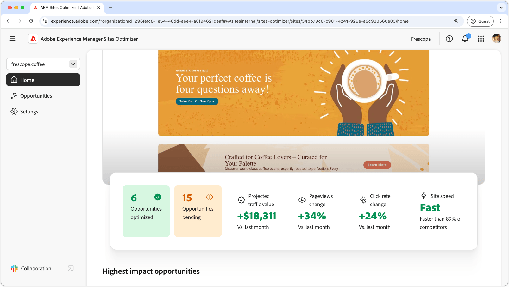

# AEM Sites Optimizer

>[!VIDEO](https://video.tv.adobe.com/v/3455089/?learn=on&enablevpops&captions=swe)

Adobe Experience Manager (AEM) Sites Optimizer är en molnbaserad tjänst som analyserar och förbättrar prestanda för webbplatser som bygger på AEM. Här identifieras områden för bättre sidinläsning, komponentanvändning och innehållsleverans. Den här funktionen förbättrar webbplatsens prestanda samtidigt som underhålls- och uppdateringskostnaderna minskar. Genom att använda Sites Optimizer kan ni säkerställa en smidig och tillförlitlig onlineupplevelse, vilket är viktigt för att upprätthålla engagemang och konverteringar.

## Kom igång med Sites Optimizer

<!-- CARDS 

* ./opportunity-types/overview.md
   {title=Opportunity types}
   {description = Learn about the available Site Optimizer opportunities and how to use them to improve your site's performance.}
* ./documentation/overview.md
  * {title=Documentation}
  * {description=Explore the Sites Optimizer documentation to learn about all its capabilities.}

-->
<!-- START CARDS HTML - DO NOT MODIFY BY HAND -->

    

        

            

                <figure class="image x-is-16by9">
                    
                </figure>
            

            

                

                    

                        <a href="./opportunity-types/overview.md" target="_blank" rel="referrer" title="Affärsmöjlighetstyper">Affärsmöjlighetstyper</a>
                    

                    
Läs mer om de tillgängliga möjligheterna med Site Optimizer och hur du kan använda dem för att förbättra webbplatsens prestanda.

                

                <a href="./opportunity-types/overview.md" target="_blank" rel="referrer" class="spectrum-Button spectrum-Button--outline spectrum-Button--primary spectrum-Button--sizeM" style="align-self: flex-start; margin-top: 1rem;">
                    Läs mer
                </a>
            

        

    

    

        

            

                <figure class="image x-is-16by9">
                    
                </figure>
            

            

                

                    

                        <a href="./documentation/overview.md" target="_blank" rel="referrer" title="Dokumentation">Dokumentation</a>
                    

                    
Läs Sites Optimizer dokumentation om alla dess funktioner.

                

                <a href="./documentation/overview.md" target="_blank" rel="referrer" class="spectrum-Button spectrum-Button--outline spectrum-Button--primary spectrum-Button--sizeM" style="align-self: flex-start; margin-top: 1rem;">
                    Läs mer
                </a>
            

        

    

<!-- END CARDS HTML - DO NOT MODIFY BY HAND -->
