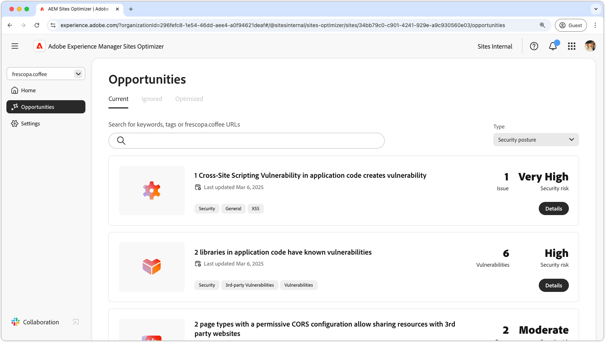

# Affärsmöjlighetstyper

{align="center"}

AEM Sites Optimizer ger värdefull information och rekommendationer som hjälper dig att förbättra webbplatsens prestanda, användbarhet och säkerhet. Dessa insikter grupperas i följande nyckelområden:

* Engagemang
* Trafikförvärv
* Säkerhetsläge
* Platshälsa

För varje kategori visas ett sätt att förbättra webbplatsen. En kategori kan öka besökarens interaktion. Ett annat kan förbättra upptäckten. Andra fokuserar på att stärka säkerheten eller på att upprätthålla webbplatsens stabilitet.

Genom att utnyttja dessa möjligheter kan ni förbättra användarupplevelsen, locka rätt målgrupp och säkra och tillförlitliga webbplatser. Ökat engagemang och ökad trafik skapar interaktion och ökad synlighet, samtidigt som en stark säkerhetsposition och webbplatshälsa bidrar till att säkra tillit och stabilitet.  Utforska länkarna nedan för att se möjligheter ordnade efter kategori och hitta sätt att förbättra webbplatsen.

## Typer av affärsmöjligheter

<!-- CARDS 

* ./engagement.md
   { title = Engagement }
* ./security-posture.md
   { title = Security posture }
* ./site-health.md
   { title = Site health }
* ./traffic-acquisition.md
   { title = Traffic acquisition }

-->
<!-- START CARDS HTML - DO NOT MODIFY BY HAND -->

    

        

            

                <figure class="image x-is-16by9">
                    
                </figure>
            

            

                

                    

                        <a href="./engagement.md" target="_blank" rel="referrer" title="Engagemang">Förlovning</a>
                    

                    
Lär dig hur ni kan förbättra engagemanget med Sites Optimizer.

                

                <a href="./engagement.md" target="_blank" rel="referrer" class="spectrum-Button spectrum-Button--outline spectrum-Button--primary spectrum-Button--sizeM" style="align-self: flex-start; margin-top: 1rem;">
                    Läs mer
                </a>
            

        

    

    

        

            

                <figure class="image x-is-16by9">
                    
                </figure>
            

            

                

                    

                        <a href="./security-posture.md" target="_blank" rel="referrer" title="Säkerhetsposition">Säkerhetsposition</a>
                    

                    
Lär dig hur du förbättrar säkerheten på din webbplats med Sites Optimizer.

                

                <a href="./security-posture.md" target="_blank" rel="referrer" class="spectrum-Button spectrum-Button--outline spectrum-Button--primary spectrum-Button--sizeM" style="align-self: flex-start; margin-top: 1rem;">
                    Läs mer
                </a>
            

        

    

    

        

            

                <figure class="image x-is-16by9">
                    
                </figure>
            

            

                

                    

                        <a href="./site-health.md" target="_blank" rel="referrer" title="Webbplatshälsa">Webbplatshälsa</a>
                    

                    
Lär dig hur du kan förbättra webbplatsens hälsa med Sites Optimizer.

                

                <a href="./site-health.md" target="_blank" rel="referrer" class="spectrum-Button spectrum-Button--outline spectrum-Button--primary spectrum-Button--sizeM" style="align-self: flex-start; margin-top: 1rem;">
                    Läs mer
                </a>
            

        

    

    

        

            

                <figure class="image x-is-16by9">
                    
                </figure>
            

            

                

                    

                        <a href="./traffic-acquisition.md" target="_blank" rel="referrer" title="Trafikförvärv">Trafikförvärv</a>
                    

                    
Lär dig hur du kan öka trafiken med Sites Optimizer.

                

                <a href="./traffic-acquisition.md" target="_blank" rel="referrer" class="spectrum-Button spectrum-Button--outline spectrum-Button--primary spectrum-Button--sizeM" style="align-self: flex-start; margin-top: 1rem;">
                    Läs mer
                </a>
            

        

    

<!-- END CARDS HTML - DO NOT MODIFY BY HAND -->
