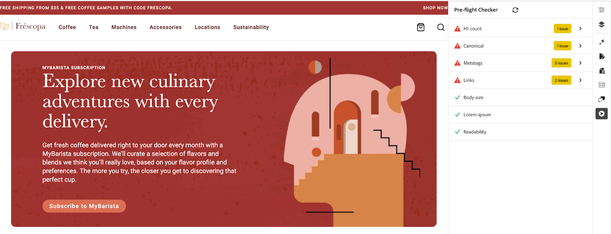

# Preflight-möjligheter

{align="center"}

Med AEM Sites Optimizer preflight-möjligheter kan du säkerställa att dina webbsidor är optimerade för prestanda, SEO och användarupplevelse innan de publiceras. Genom att identifiera potentiella problem som brutna länkar, saknade metataggar och problem med tillgänglighet kan man med preflight-kontroller åtgärda dessa problem tidigt i publiceringsprocessen. Detta proaktiva tillvägagångssätt minimerar risken för att publicera suboptimalt innehåll, förbättrar webbplatsens kvalitet och förbättrar den totala digitala närvaron. Genom att utnyttja preflightmöjligheter får du ett smidigare arbetsflöde, färre postpubliceringskorrigeringar och bättre sökmotorrankning och nöjdare användare.

## Möjligheter

<!-- CARDS

* ../documentation/opportunities/invalid-or-missing-metadata.md
  {title=Canonical}
  {image=../assets/common/card-link.png}
* ../documentation/opportunities/broken-internal-links.md
  {title=Broken Internal Links}
  {image=../assets/common/card-link.png}
* ../documentation/opportunities/invalid-or-missing-metadata.md
  {title=Metatags}
  {image=../assets/common/card-code.png}
* ../documentation/opportunities/invalid-or-missing-metadata.md
  {title=H1 count}
  {image=../assets/common/card-code.png}
* ../documentation/opportunities/accessibility-issues.md
  {title=Accessibility}
  {image=../assets/common/card-puzzle.png}

-->
<!-- START CARDS HTML - DO NOT MODIFY BY HAND -->
<div class="columns">
    <div class="column is-half-tablet is-half-desktop is-one-third-widescreen" aria-label="Canonical">
        <div class="card" style="height: 100%; display: flex; flex-direction: column; height: 100%;">
            <div class="card-image">
                <figure class="image x-is-16by9">
                    <a href="../documentation/opportunities/invalid-or-missing-metadata.md" title="Kanoniska" target="_blank" rel="referrer">
                        
                    </a>
                </figure>
            </div>
            <div class="card-content is-padded-small" style="display: flex; flex-direction: column; flex-grow: 1; justify-content: space-between;">
                <div class="top-card-content">
                    <p class="headline is-size-6 has-text-weight-bold">
                        <a href="../documentation/opportunities/invalid-or-missing-metadata.md" target="_blank" rel="referrer" title="Kanoniska">Kanonisk</a>
                    </p>
                    <p class="is-size-6">Lär dig mer om den kanoniska möjligheten och hur du använder den för att förbättra SEO och förhindra problem med duplicerat innehåll.</p>
                </div>
                <a href="../documentation/opportunities/invalid-or-missing-metadata.md" target="_blank" rel="referrer" class="spectrum-Button spectrum-Button--outline spectrum-Button--primary spectrum-Button--sizeM" style="align-self: flex-start; margin-top: 1rem;">
                    <span class="spectrum-Button-label has-no-wrap has-text-weight-bold">Läs mer</span>
                </a>
            </div>
        </div>
    </div>
    <div class="column is-half-tablet is-half-desktop is-one-third-widescreen" aria-label="Broken Internal Links">
        <div class="card" style="height: 100%; display: flex; flex-direction: column; height: 100%;">
            <div class="card-image">
                <figure class="image x-is-16by9">
                    <a href="../documentation/opportunities/broken-internal-links.md" title="Brutna interna länkar" target="_blank" rel="referrer">
                        
                    </a>
                </figure>
            </div>
            <div class="card-content is-padded-small" style="display: flex; flex-direction: column; flex-grow: 1; justify-content: space-between;">
                <div class="top-card-content">
                    <p class="headline is-size-6 has-text-weight-bold">
                        <a href="../documentation/opportunities/broken-internal-links.md" target="_blank" rel="referrer" title="Brutna interna länkar">Brutna interna länkar</a>
                    </p>
                    <p class="is-size-6">Lär dig mer om de brutna interna länkarna och hur du använder dem för att identifiera och åtgärda brutna eller problematiska länkar på din webbplats.</p>
                </div>
                <a href="../documentation/opportunities/broken-internal-links.md" target="_blank" rel="referrer" class="spectrum-Button spectrum-Button--outline spectrum-Button--primary spectrum-Button--sizeM" style="align-self: flex-start; margin-top: 1rem;">
                    <span class="spectrum-Button-label has-no-wrap has-text-weight-bold">Läs mer</span>
                </a>
            </div>
        </div>
    </div>
    <div class="column is-half-tablet is-half-desktop is-one-third-widescreen" aria-label="Metatags">
        <div class="card" style="height: 100%; display: flex; flex-direction: column; height: 100%;">
            <div class="card-image">
                <figure class="image x-is-16by9">
                    <a href="../documentation/opportunities/invalid-or-missing-metadata.md" title="Metataggar" target="_blank" rel="referrer">
                        
                    </a>
                </figure>
            </div>
            <div class="card-content is-padded-small" style="display: flex; flex-direction: column; flex-grow: 1; justify-content: space-between;">
                <div class="top-card-content">
                    <p class="headline is-size-6 has-text-weight-bold">
                        <a href="../documentation/opportunities/invalid-or-missing-metadata.md" target="_blank" rel="referrer" title="Metataggar">Metataggar</a>
                    </p>
                    <p class="is-size-6">Lär dig mer om möjligheterna med metataggar och hur du använder dem för att optimera sidans metadata för bättre SEO-prestanda.</p>
                </div>
                <a href="../documentation/opportunities/invalid-or-missing-metadata.md" target="_blank" rel="referrer" class="spectrum-Button spectrum-Button--outline spectrum-Button--primary spectrum-Button--sizeM" style="align-self: flex-start; margin-top: 1rem;">
                    <span class="spectrum-Button-label has-no-wrap has-text-weight-bold">Läs mer</span>
                </a>
            </div>
        </div>
    </div>
    <div class="column is-half-tablet is-half-desktop is-one-third-widescreen" aria-label="H1 count">
        <div class="card" style="height: 100%; display: flex; flex-direction: column; height: 100%;">
            <div class="card-image">
                <figure class="image x-is-16by9">
                    <a href="../documentation/opportunities/invalid-or-missing-metadata.md" title="H1-antal" target="_blank" rel="referrer">
                        
                    </a>
                </figure>
            </div>
            <div class="card-content is-padded-small" style="display: flex; flex-direction: column; flex-grow: 1; justify-content: space-between;">
                <div class="top-card-content">
                    <p class="headline is-size-6 has-text-weight-bold">
                        <a href="../documentation/opportunities/invalid-or-missing-metadata.md" target="_blank" rel="referrer" title="H1-antal">H1-antal</a>
                    </p>
                    <p class="is-size-6">Lär dig mer om möjligheten att räkna H1 och hur du använder det för att säkerställa korrekt rubrikstruktur och SEO-optimering.</p>
                </div>
                <a href="../documentation/opportunities/invalid-or-missing-metadata.md" target="_blank" rel="referrer" class="spectrum-Button spectrum-Button--outline spectrum-Button--primary spectrum-Button--sizeM" style="align-self: flex-start; margin-top: 1rem;">
                    <span class="spectrum-Button-label has-no-wrap has-text-weight-bold">Läs mer</span>
                </a>
            </div>
        </div>
    </div>
    <div class="column is-half-tablet is-half-desktop is-one-third-widescreen" aria-label="Accessibility">
        <div class="card" style="height: 100%; display: flex; flex-direction: column; height: 100%;">
            <div class="card-image">
                <figure class="image x-is-16by9">
                    <a href="../documentation/opportunities/accessibility-issues.md" title="Tillgänglighet" target="_blank" rel="referrer">
                        
                    </a>
                </figure>
            </div>
            <div class="card-content is-padded-small" style="display: flex; flex-direction: column; flex-grow: 1; justify-content: space-between;">
                <div class="top-card-content">
                    <p class="headline is-size-6 has-text-weight-bold">
                        <a href="../documentation/opportunities/accessibility-issues.md" target="_blank" rel="referrer" title="Tillgänglighet">Tillgänglighet</a>
                    </p>
                    <p class="is-size-6">Lär dig mer om tillgänglighetsmöjligheterna och hur du använder dem för att se till att webbplatsen är tillgänglig för alla användare.</p>
                </div>
                <a href="../documentation/opportunities/accessibility-issues.md" target="_blank" rel="referrer" class="spectrum-Button spectrum-Button--outline spectrum-Button--primary spectrum-Button--sizeM" style="align-self: flex-start; margin-top: 1rem;">
                    <span class="spectrum-Button-label has-no-wrap has-text-weight-bold">Läs mer</span>
                </a>
            </div>
        </div>
    </div>

</div>
<!-- END CARDS HTML - DO NOT MODIFY BY HAND -->

## Inställningar

AEM Sites Optimizer Preflight-identifiering av affärsmöjligheter kräver att du har skapat Preflight-tillägget i antingen Universal Editor, Document-Based Preview eller AEM Cloud Service för att kunna köra preflight-granskningar på sidorna innan de publiceras.

### Aktivera användaråtkomst

Om du vill använda preflight-tillägget måste du se till att din användare har tilldelats minst en av följande AEM Sites Optimizer-produktprofiler i [Adobe Admin Console](https://adminconsole.adobe.com):

* AEM Sites Optimizer - Föreslå användare automatiskt
* AEM Sites Optimizer - Automatisk optimering av användare

### Aktivera Preflight-tillägget

>[!BEGINTABS]

>[!TAB Universell redigerare]

Så här ställer du in Preflight i Universal Editor:

1. Öppna **Extension Manager** på:
   [https://experience.adobe.com/#/@org/aem/extension-manager/universal-editor](https://experience.adobe.com/#/@org/aem/extension-manager/universal-editor)
1. Leta reda på **AEM Sites Optimizer Preflight-tillägget** och skicka en begäran om att aktivera det.
1. **Adobe AEM-teamet** granskar och aktiverar tillägget för din organisation.
1. När tillägget har aktiverats öppnar du en sida i **Universell redigerare**, till exempel:
   `https://author-p12345-e123456.adobeaemcloud.com/ui#/@org/aem/universal-editor/canvas/author-p12345-e123456.adobeaemcloud.com/content/en/example/home.html`
1. **Preflight-tillägget** visas i **sidospåret**.
1. Välj **Preflight-tillägget** från sidospåret för att starta en **Preflight-granskning** av den aktuella sidan.

>[!TAB Dokumentbaserad redigering]

Så här ställer du in preflight för dokumentbaserad redigering:

1. Lägg till följande konfiguration till `/tools/sidekick/config.json` i ditt Edge Delivery Services-projekts GitHub-databas:

   ```json
   {
     "plugins": [
       {
         "id": "preflight",
         "titleI18n": {
           "en": "Preflight"
         },
         "environments": ["preview"],
         "event": "preflight"
       }
     ]
   }
   ```

1. Skapa en ny fil `/tools/sidekick/aem-sites-optimizer-preflight.js` och lägg till följande innehåll:

   ```javascript
   (function () {
     let isAEMSitesOptimizerPreflightAppLoaded = false;
     function loadAEMSitesOptimizerPreflightApp() {
       const script = document.createElement('script');
       script.src = 'https://experience.adobe.com/solutions/OneAdobe-aem-sites-optimizer-preflight-mfe/static-assets/resources/sidekick/client.js?source=plugin';
       script.onload = function () {
         isAEMSitesOptimizerPreflightAppLoaded = true;
       };
       script.onerror = function () {
         console.error('Error loading AEMSitesOptimizerPreflightApp.');
       };
       document.head.appendChild(script);
     }
   
     function handlePluginButtonClick() {
       if (!isAEMSitesOptimizerPreflightAppLoaded) {
         loadAEMSitesOptimizerPreflightApp();
       }
     }
   
     // Sidekick V1 extension support
     const sidekick = document.querySelector('helix-sidekick');
     if (sidekick) {
       sidekick.addEventListener('custom:preflight', handlePluginButtonClick);
     } else {
       document.addEventListener('sidekick-ready', () => {
         document.querySelector('helix-sidekick')
           .addEventListener('custom:preflight', handlePluginButtonClick);
       }, { once: true });
     }
   
     // Sidekick V2 extension support
     const sidekickV2 = document.querySelector('aem-sidekick');
     if (sidekickV2) {
       sidekickV2.addEventListener('custom:preflight', handlePluginButtonClick);
     } else {
       document.addEventListener('sidekick-ready', () => {
         document.querySelector('aem-sidekick')
           .addEventListener('custom:preflight', handlePluginButtonClick);
       }, { once: true });
     }
   }());
   ```

1. Uppdatera funktionen `loadLazy()` i `/scripts/scripts.js` för att importera preflight-skriptet för förhandsgransknings-URL:er:

   ```javascript
   if (window.location.href.includes('.aem.page')) {
      import('../tools/sidekick/aem-sites-optimizer-preflight.js');
   }
   ```

1. Öppna förhandsgransknings-URL:en (`*.aem.page`) för sidan som du vill granska.
1. I **Sidekick** klickar du på knappen **Preflight** för att starta granskningen av den aktuella sidan.

>[!TAB AEM Sites Page Editor]

Om du vill använda Preflight i AEM Sites Page Editor kan du skapa ett bokmärke i webbläsaren. Följ de här stegen:

1. Visa **bokmärkesfältet** i webbläsaren:

   * Tryck på **Ctrl+Skift+B** (Windows) eller **Cmd+Skift+B** (Mac).

! Skapa ett nytt bokmärke i webbläsaren:

* Högerklicka på bokmärkesfältet och välj **Ny sida** eller **Lägg till bokmärke**.
* Klistra in följande kod i fältet **Adress (URL)**:

```javascript
javascript:(function(){const script=document.createElement('script');script.src='https://experience.adobe.com/solutions/OneAdobe-aem-sites-optimizer-preflight-mfe/static-assets/resources/sidekick/client.js?source=bookmarklet&target-source=aem-cloud-service';document.head.appendChild(script);})();
```

1. Namnge bokmärket **Preflight** (eller något annat namn du föredrar).
1. Öppna förhandsgransknings-URL:en (`*.aem.page`) för sidan som du vill granska i **AEM Sites Page Editor**.
1. Klicka på bokmärket **Preflight** i bokmärkesfältet för att starta granskningen av den aktuella sidan.

>[!ENDTABS]

## God praxis

Tänk på följande när du kör preflight-granskningar:

* Kör alltid granskningar på **mellanlagrings- eller förhandsgranskningssidor** innan du publicerar till produktion.
* Prioritera lösningen av **viktiga problem**, till exempel brutna länkar, saknade H1-taggar eller osäkra länkar.
* Kontrollera att **autentisering är aktiverat** för skyddade mellanlagringsmiljöer innan du kör granskningar.
* Granska och använd **metataggrekommendationer** för att förbättra SEO-prestanda.
