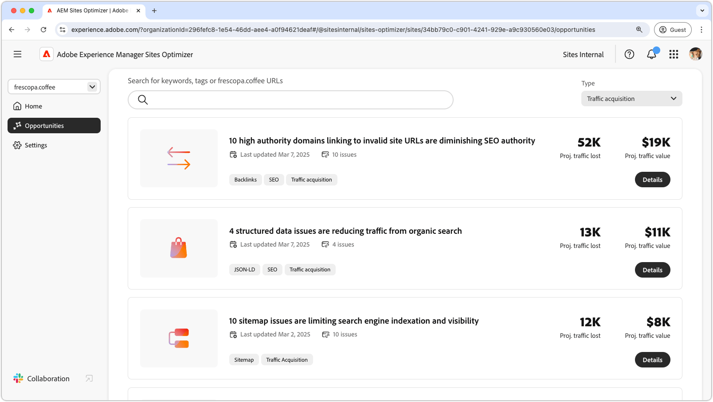

# Trafikförvärv

{align="center"}

Trafikförvärv driver potentiella kunder till er webbplats och skapar försäljnings- eller ledmöjligheter. Genom att använda strategier som SEO (sökmotoroptimering) kan företag förbättra söksynligheten och göra det enklare för användarna att upptäcka sitt innehåll. Ett stadigt flöde av besökare ökar varumärkeskännedomen och skapar förtroende. Det ger även värdefulla insikter om användarbeteenden. Dessa insikter hjälper team att förfina sina erbjudanden och förbättra den övergripande upplevelsen. Med AEM Sites Optimizer insikter kan ni optimera kontinuerligt och få en hållbar tillväxt och bättre konverteringsgrad över tid.

## Möjligheter

<!-- CARDS
 
* ../documentation/opportunities/broken-backlinks.md
  {title=Broken backlinks}
  {image=../assets/common/card-arrows.png}
* ../documentation/opportunities/invalid-or-missing-metadata.md
  {title=Invalid or missing metadata}
  {image=../assets/common/card-code.png}
* ../documentation/opportunities/missing-invalid-structured-data.md
  {title=Missing or invalid structured data}
  {image=../assets/common/card-bag.png}
* ../documentation/opportunities/sitemap-issues.md
  {title=Sitemap issues}
  {image=../assets/common/card-relationship.png}

--->
<!-- START CARDS HTML - DO NOT MODIFY BY HAND -->

    

        

            

                <figure class="image x-is-16by9">
                    
                </figure>
            

            

                

                    

                        <a href="../documentation/opportunities/broken-backlinks.md" target="_blank" rel="referrer" title="Brutna bakterier">Brutna baklänkar</a>
                    

                    
Lär dig mer om den brutna bakåtlänksmöjligheten och hur du kan använda den för att förbättra trafikförvärvet.

                

                <a href="../documentation/opportunities/broken-backlinks.md" target="_blank" rel="referrer" class="spectrum-Button spectrum-Button--outline spectrum-Button--primary spectrum-Button--sizeM" style="align-self: flex-start; margin-top: 1rem;">
                    Läs mer
                </a>
            

        

    

    

        

            

                <figure class="image x-is-16by9">
                    
                </figure>
            

            

                

                    

                        <a href="../documentation/opportunities/invalid-or-missing-metadata.md" target="_blank" rel="referrer" title="Ogiltiga eller saknade metadata">Ogiltiga eller saknade metadata</a>
                    

                    
Lär dig mer om ogiltiga eller saknade metadatamöjligheter och hur du kan använda dem för att förbättra trafikförvärvet.

                

                <a href="../documentation/opportunities/invalid-or-missing-metadata.md" target="_blank" rel="referrer" class="spectrum-Button spectrum-Button--outline spectrum-Button--primary spectrum-Button--sizeM" style="align-self: flex-start; margin-top: 1rem;">
                    Läs mer
                </a>
            

        

    

    

        

            

                <figure class="image x-is-16by9">
                    
                </figure>
            

            

                

                    

                        <a href="../documentation/opportunities/missing-invalid-structured-data.md" target="_blank" rel="referrer" title="Saknade eller ogiltiga strukturerade data">Ogiltiga strukturerade data saknas</a>
                    

                    
Lär dig mer om den saknade eller ogiltiga strukturerade datamöjligheter och hur du kan använda den för att förbättra trafikförvärvet.

                

                <a href="../documentation/opportunities/missing-invalid-structured-data.md" target="_blank" rel="referrer" class="spectrum-Button spectrum-Button--outline spectrum-Button--primary spectrum-Button--sizeM" style="align-self: flex-start; margin-top: 1rem;">
                    Läs mer
                </a>
            

        

    

    

        

            

                <figure class="image x-is-16by9">
                    
                </figure>
            

            

                

                    

                        <a href="../documentation/opportunities/sitemap-issues.md" target="_blank" rel="referrer" title="Problem med webbplatskarta">Problem med webbplatskarta</a>
                    

                    
Lär dig mer om möjligheterna med webbplatskartor och hur du kan använda den för att förbättra trafikförvärvet.

                

                <a href="../documentation/opportunities/sitemap-issues.md" target="_blank" rel="referrer" class="spectrum-Button spectrum-Button--outline spectrum-Button--primary spectrum-Button--sizeM" style="align-self: flex-start; margin-top: 1rem;">
                    Läs mer
                </a>
            

        

    

<!-- END CARDS HTML - DO NOT MODIFY BY HAND -->
